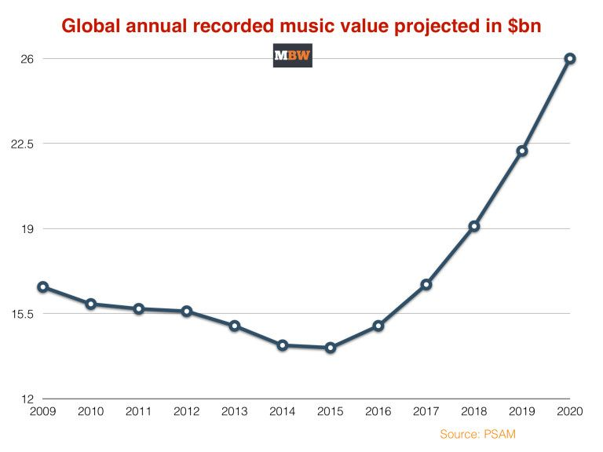
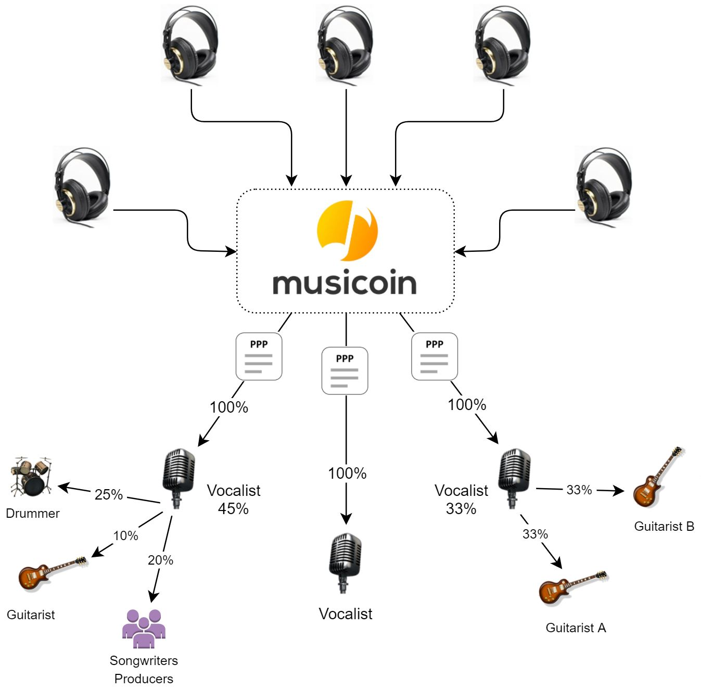

# 
MUSICOIN

彻底改变音乐创作、分享与消费的分布式平台。

A decentralized platform  revolutionizing creation, distribution and consumption of  music .

白皮书
版本：2.0.0 
2017-10
 

目录

[TOC]

## 摘要 ABSTRACT 

Musicoin is a decentralized platform that leverages the power of blockchain technology in empowering musicians to take full ownership of their content and finances. Our platform is built on a transparent Peer-to-Peer network powered by programmable smart contracts to enable fair remuneration for all musical content and services. Our long-term vision is to develop an open ecosystem where outside providers can build music related goods and services on top of the Musicoin platform. 

Musicoin 是一个分布式的音乐平台，充分利用了区块链技术的力量，让音乐家能够充分掌握自己的作品与收入。 我们的平台建立在透明的点对点网络基础之上，并通过智能合约技术为所有音乐内容和服务提供最公平的报酬。 我们的长期愿景是建设一个开放的生态系统，第三方合作伙伴也可以在 Musicoin 平台上建立与音乐相关的商业及服务。

## 项目远景 PROJECT VISION 

Our vision is to establish our brand as a global music platform that provides fair remuneration, distribution, and exposure for independent musicians. Our approach in product awareness is global in scope and local in execution. By 2020, we are aiming to license more than 30 million tracks and host at least 1 million independent musicians on our platform. Since our project’s inception in February 2017, we have built a music streaming platform that hosts more than 5,800 tracks created by our 1,300 musicians and serves 18,000 listeners from all over the globe. This is just the beginning as we continue to iterate and build the platform in a way that is more intuitive and user-friendly to musicians,listeners and outside providers. 

我们的愿景是将 Musicoin 建设为全球音乐平台，帮助独立音乐家进行发行与展示并获得公平的报酬。 我们的平台面向全球，但依靠本地执行。我们的目标是，到 2020 年在 Musicoin 平台上吸引至少 100 万名独立音乐家加入，并获得授权歌曲 3000 万首以上。 项目自2017年2月成立以来，我们已经建立起了一个音乐流媒体平台，目前平台拥有 1,300 多位音乐家以及他们创作的超过 5800 首歌曲，并为来自全球各地的 18,000 名听众提供收听服务。 但这只是一个开始，我们将继续构建系统、迭代开发，为音乐家、听众以及第三方合作伙伴提供更直观、更方便、更好用的平台。

## 市场 MARKET 

In recent years, the recording music industry has seen a considerable boom in revenue due to rising digital sales. IFPI (International Federation of the Phonographic Industry) reported an industry growth of 5.9% in revenue in 2016, the fastest rate of growth since 1997 [1] , with a market capitalisation of 15 billion USD. The graph below shows industry valuation beyond 2016. The music industry is projected to achieve exponential growth and double its market capitalisation ($26 billion USD) by 2020 (Figure 1). 

近年来，由于数字产业销售的增长，音乐行业的收入也大幅增加。 根据国际唱片业协会（ [IFPI](http://www.ifpi.org/) ）的报告显示，2016年营收同比增长5.9％，为1997年以来最高的增长率[^1]，市值达150亿美元。下图显示了2016年后的行业估值，预计到2020年，音乐行业将实现指数级增长，市值将翻倍（260亿美元）（图1）。

图1. 2015年至2020年录音与出版产业的全球年度估值[^2]。Figure 1. Global annual value of the recorded music industry from 2015 to 2020 [2] . 

Moreover, revenue streams such as streaming continue to grow with a huge upside potential, while revenue from performance rights and synchronisation remain undervalued within the industry. 

此外，诸如流媒体等收入继续增长，也具有巨大的上行潜力，而在行业内，其价值与收入仍然被低估。

### Streaming 在线播放收入

Streaming has become the most prevalent form of music consumption in the modern music industry, fueling growth in almost all major markets and beginning to unlock the phenomenal potential within developing territories [1] . The year 2016 saw streaming revenue as the top contributor to market growth with an increase of 60.4% – the largest growth in eight years ( Figure 2 ). It now makes up 59% of the total digital music revenues, to the tune of $7.8 billion USD. PSAM (P. Schoenfeld Asset Management), one of the leading American hedge funds, project that streaming music will lift industry revenues by more than 80% from 2014 through 2020 and the industry can reach 15% annual revenue growth before the end of the decade [^3] . 

在线播放音乐流媒体已经成为现代音乐产业中最流行的消费方式，几乎在所有主要市场均有增长，并开始在发展中地区释放出巨大潜力[^1]。 2016 年，流媒体收入成为市场增长的主要贡献者，增长率达 60.4％，为八年来最大增幅（图2）。 现在占数字音乐总收入的 59％，达到 78 亿美元。 美国领先的对冲基金之一 P. Schoenfeld 资产管理公司（ [PSAM](https://psam.com/) ）表示，从 2014 年到 2020 年，~~流媒体音乐在产业内收入所占的比例将超过 80％~~，在接下来的十年，该行业可实现年收入增长15％ [^3]。

​This is accompanied by a tremendous increase in consumer appetite for independent music. From the beginning of 2015 to the end of 2016, the number of indie music listeners grew by 141% [4] . These numbers will continue to grow as streaming music services and shared playlists increase in popularity [5] . 

伴随着消费者对独立音乐需求的大幅增长。 从 2015 年开始到 2016 年底，独立音乐听众的数量增长了 141％[^4]。 随着流媒体音乐服务和~~共享播放列表~~的普及，这些数字将继续增长[^5]。

图2. 2012 年至 2016 年全球音乐流媒体市场增长情况[^1]。Figure  2.  Global  market  growth  in  music  streaming  from  2012  to  2016 [^1] . 

### Performance Rights 播放权收入

The revenue generated by the use of recorded music by broadcasters and public venues – grew by 7% to $2.2 billion USD in 2016. This revenue stream accounts for 14% of the market but remains significantly undervalued [1] . Therefore, IFPI believes that the global performance rights market has significant growth potential [1] . 

由广播公司和公共场所使用音乐所产生的收入在 2016 年增长了 7％，达到 \$22 亿美元。这一收入来源占市场的 14％，但仍然被低估了[^1]。 因此，IFPI 认为全球音乐播放收入市场仍然具有显著的增长潜力[^1]。

### Synchronisation 其它

The revenue from the use of music in advertising, films, games and television programmes – grew by 2.8% in 2016 compared to the 7% growth in 2015. It has maintained its 2% share of the global market [1] and is expected to grow significantly in the future. 

在广告、电影、游戏和电视节目中使用音乐的收入 —— 2016 年增长了2.8％，而2015 年增长了7％，并保持了其在全球市场 2％ 的份额[^1]，预计未来将大幅增长。

## 问题 THE PROBLEM 

The onset of the digital age in the 1980s allowed the likes of Napster to become a disruptive force in the recording industry. Peer-to-Peer file sharing ( Figure 3 ) allowed people to pirate content online without legal implications. This caused a huge uproar amongst musicians because they were not compensated for their work, which ultimately forced the industry to adapt and embrace streaming technology in the early 2000s. The reasoning behind the shift towards streaming rather than owning content, was to facilitate a more interactive relationship between listeners and musicians, and to drive listeners away from piracy by offering them a free and legal alternative to accessing music. 

20 世纪 80 年代数字时代的到来使得 [Napster](https://napster.com) 等公司成为唱片行业的颠覆性力量。 点对点文件共享（ 图3 ）允许人们在网上盗版内容而无法进行法律制约。 这引起了音乐家们的轩然大波，因为他们的工作无法得到回报，最终迫使该行业在 21 世纪初适应并采用流媒体技术。逐渐放弃通过传统媒介传递音乐，而转向流媒体的一个理由是通过流媒体可以促进听众与音乐家之间的互动关系，并通过为听众提供合法而免费的音乐，让听众远离盗版。

图3.音乐家曾经完全忽视点对点传播模式。 Figure 3. Musicians are completely disregarded from a Peer-to-Peer torrent model. 

However, even with an unprecedented reduction in piracy and growth of the streaming market, the music industry is still facing the same problem. Musicians, especially the upcoming and the lesser-known ones, derive a paltry portion of the total revenue generated from their work because most of that revenue is consumed by intermediaries, the same entities who claim to represent their best interests. This problem is predominantly due to centralization, lack of transparency and an unsustainable business model. 

然而，即使盗版及流媒体市场有很大的减少，音乐行业仍然面临着一个传统的困境：就是音乐家，特别是新的以及不太知名的音乐家，在现有的商业模式下，他们从工作中获得的报酬总是很少，因为大部分收入都被中间人所占有，而这些中间人还自称代表音乐家的利益。这个问题主要是由于集中化、缺乏透明性所导致的不可持续的商业模式所造成的。

### Centralization 集权

Today, about 88.5% of the global music industry is largely dominated by three multinational record labels; Universal Music Group, Sony Music Entertainment, and Warner Music Group [6] . These record label companies (with sub-labels and publishing companies as subsidiaries) oversee most of the music distribution. Because of such market monopoly, they are in a position to dictate market rules that are most favorable to them. They often enforce unfair contracts in negotiations with streaming services, receive large advances and bargain for minimum payment and ownership positions under non-disclosure agreements [7] . Centralization of revenue and power among music producers and publishers has also led to egregious abuse of nascent centralized streaming platforms. For example, recently Sony Music threatened to withdraw all its content  from  Pandora,  claiming  that  the  royalty  rates were  too  low [8] . 

今天，全球约 88.5％ 的音乐产业由三家跨国唱片公司主导：环球音乐集团、索尼音乐娱乐公司和华纳音乐集团[^6]。 这些唱片公司（及其出版子公司）控制了大部分的音乐发行。 由于这种市场垄断，他们有能力制定最有利于他们的市场规则。 他们通常在与流媒体服务的谈判中执行不公平的合同，~~在保密协议下获得大笔预付款，讨价还价的最低付款，和所有权职位~~[^7]。 ~~音乐制作人和出版商之间收入和权力的集中化也导致了对新兴的集中式流媒体平台的极端滥用。~~ 例如，最近索尼音乐威胁要从 [Pandora](https://www.pandora.com) 手中收回所有内容，声称版税费率太低[^8]。

Similarly, data management is also becoming centralized. Streaming companies must appease to prevalent practices in the industry even if such practices are inefficient or outdated. In 2014, Spotify announced that they are abandoning Peer-to-Peer (P2P) technology, which has once helped the startup reduce bandwidth costs and saved them millions of dollars in operating expenses every year, in favor of storing its catalog in a more  traditional  centralized  server  architecture [9] . 

同样，数据管理也正在变得集中。 即使这些做法效率低下或过时，流媒体公司也必须接受业内流行的做法。 2014年，[Spotify](https://www.spotify.com) 宣布放弃 P2P 技术，该技术曾帮助创业公司降低带宽成本，每年为其节省数百万美元的运营开支，~~有利于将其目录存储为更传统的集中式服务器架构~~[^9]。

Moreover, the current revenue share model in the streaming music industry is unfair to all musicians and particularly detrimental to independent and aspiring musicians. In revenue share contracts between record labels and streaming companies, most of the revenue goes towards paying the intermediaries, and musicians are almost always left out of these discussions. This results in a royalty distribution scheme that heavily favors intermediaries, at the expense of the musicians, ultimately undervaluing the musician’s work and revenue. The following is a breakdown of how royalty is typically distributed to musicians by streaming platforms like Spotify and Apple Music [^10] ,

此外，流媒体音乐行业目前的收入分成模式对所有音乐家都不公平，对独立和有抱负的音乐家尤其不利。 在唱片公司和流媒体公司之间的收入分成合同中，大部分收入用于支付中间商，音乐家几乎总是被排除在讨论之外。 这导致了一个特许权分配计划，该计划严重倾向于中间人，这是以音乐家为代价的，最终低估了音乐家的工作和收入。 以下是 Spotify 和 [Apple Music](https://www.apple.com/music/) 等流媒体平台通常向音乐人分发版税的细目[^10]，

​“...it’s beneficial to understand how streaming royalties are generally calculated and paid: 

1. The monthly revenue of a service (Spotify, Apple Music, et al.) is calculated. 
2. ​Record labels have deals in place to get their royalty percentage flat, right off the top, so they receive their share of revenue first. 
3. ​The Performance Rights Organizations (PRO) also have flat percentage deals in place, and they are paid next. 
4. ​The streaming companies also retain a percentage for themselves, generally 15–30%. 
5. ​The streaming services often contract various back office services, who can get a percentage too rather than a flat fee (at this point you’re looking at around 40% of the total revenue remaining, before artists, songwriters, and publishers have even been considered). 
6. ​To establish the “per play allocation,” you then take [remaining revenue / total # service plays in that month]. 
7. ​Each publisher (the people who represent the compositions) then gets a lump sum payout of [per play allocation * total # plays publisher owns]. 
8. The publisher then delivers royalties to artists and songwriters; it is incumbent on the publisher to figure out how to split up their lump-sum payment to individual owners, and they also take a cut for the administration service.” 

> “... 了解如何计算和支付流媒体使用费通常是有益的：
>
> 1. 计算服务（ Spotify，Apple Music 等）的月收入。
> 2. 唱片公司的交易已经到位，可以让他们的专利使用费比例保持不变，因此他们可以首先获得收入份额。
> 3. 表演权组织（PRO）也有固定的百分比交易，并且下一笔支付。
> 4. 流媒体公司也为自己保留一定比例，一般为 15-30％ 。
> 5. 流媒体服务通常与各种后台服务签订合同，这些服务可以获得一定比例，而不是固定费用（在这一点上，您会看到剩余总收入的 40％ 左右，而艺术家，歌曲作者和发行商甚至没有被考虑）。
> 6. ~~为了建立“每场比赛分配”，你然后采取[该月剩余收入/总计＃服务比赛]。~~
> 7. 每个发布者（代表作品的人）都会获得[每次播放分配*播放器拥有者总数]的总额支付。
> 8. 然后出版商向艺术家和词曲作者提供版税;出版商有责任弄清楚如何将一次性付款分配给个人所有者，并且他们也会削减行政服务。“

图4.目前的体系总是向音乐家支付总收入中很小的一部分。 Figure 4. Current legacy system pays musicians a small fraction of total revenue. 
 

It is painfully apparent that the musicians who created the content gets paid after and less than the intermediaries who did not participate in the creative process ( Figure 4 ). Here is another example of revenue share ( Figure 5 ), according to a research paper written by Pierre-É. Lalonde from Croatian Music Institute [7] , 

很显然，创作内容的音乐家获得的报酬要低于没有参与创作过程的中介（ 图4 ）。 这是另一个收入分配的例子（图5），根据克罗地亚音乐学院 Pierre-É.Lalonde 的研究报告[^7]：

“Currently, major record labels receive up to 97% of revenues that flow to all music rights holders, leaving just 3% to be shared among songwriters, music publishers, and other rights holders and administrators. One reason for this is that streaming services often only negotiate with the major record labels, which are supposed to represent all rights holders. In some cases, record labels are also shareholders in the streaming services, which clearly places their interests in conflict with the artists, songwriters and other rights holders they claim to represent.” 

> “目前，高达 97% 的流媒体收入归主要的唱片公司（也就是这些音乐作品权利的持有者），剩下的 3% 才归音乐家、词曲作者、音乐出版商及其它权利人分配。其中一个原因是，流媒体服务商通常只与主要的唱片公司进行谈判，因为唱片公司代表音乐作品的权利人，而在某些情况下，唱片公司也是流媒体服务商的股东。这显然与他们自称是音乐家、词曲作者及其它利益相关人的代表是冲突的。”

图5.Spotify 的版税分配公式，其中 SMR = Spotify 月收入[^11]。 Figure 5 . Formula of Spotify’s royalties distribution, where SMR = Spotify Monthly Revenue [^11] . 
 

In addition, the royalty to an artist for each stream is dependent on the nature of  that stream. According to Spotify, all plays on its platform are not equal. Premium plays  have higher payout than free-tier plays [^12] . This means that not only are musicians not  getting a proper cut of the revenue, their revenue stream is inconsistent as well. Most  artists on major platforms continue to earn less than half a penny per stream. On  average, they would need more than 500,000 plays to earn a monthly minimum wage of  $1,472 USD [13] . This has led to many musicians to vent publicly against these streaming  platforms [14] , 

~~此外，每个流媒体的艺术家版税取决于流的性质。据 Spotify 称，其平台上的所有播放都不相同。高级别比起免费级别的播放有更高的支出~~[^12]。 这意味着音乐家不仅没有得到适当的收入削减，他们的收入流也不一致。大多数主流平台上的大多数艺术家每个流的收入仍然不到半美分。平均而言，他们需要超过 500,000 次播放才能获得每月最低 \$1472 美元的收入[^13]。这导致了许多音乐家公开反对这些流媒体平台[^14]。

> “For a band of four people that makes a 15% royalty from Spotify streams, it  would take 236,549,020 streams for each person to earn a minimum wage of  15,080美元 (£9,435)  a year. For perspective, Daft Punk's song of the summer, ‘Get  Lucky’, reached 104,760,000 Spotify streams by the end of August: the two Daft  Punk guys stand to make somewhere around 13,000 each. Not bad, but remember  this is just one song from a lengthy recording that took a lot of time and money to  develop. That won't pay their bills if it's their principal source of income. And what  happens to the bands who don't have massive international summer hits?” – David  Bryne, co-founder of the band, Talking Heads.  

> “ 对于一个由 Spotify 提供 15％专利使用费的四人组合，每个人需要 236,549,020 次播放才能获得每年 \$15,080 美元（ £9435 ）的最低收入。 做为对比， 傻朋克乐团（ [Daft Punk](https://zh.wikipedia.org/wiki/%E5%82%BB%E6%9C%8B%E5%85%8B) ）夏季发布的单曲 “ 幸运儿 ”（ [Get Lucky](https://zh.wikipedia.org/wiki/%E5%B9%B8%E9%81%8B%E6%98%9F_(%E5%82%BB%E7%93%9C%E9%BE%90%E5%85%8B%E6%AD%8C%E6%9B%B2)) ）到 8 月底在 Spotify 的播放量达到了 104,760,000 次，傻朋克的两个家伙平均每人在这个站点得到了 \$13,000 美元。看上去不错，但是请记住，这是一首制作时间超长的单曲，需要花费大量时间和金钱。如果这是他们的主要收入来源，那么将不够支付账单。 ~~而那些没有大规模制作团队的乐队国际夏季乐队的乐队会发生什么？~~” - [Talking Heads](https://zh.wikipedia.org/wiki/Talking_Heads) 乐队的联合创始人 David Bryne 。
>

Needless to say, the current revenue share model of incumbent streaming platforms like Spotify and Apple music is atrociously unfair to musicians, and especially puts independent and aspiring musicians at a serious disadvantage. This has led to a growing wave of intense discontent in the artist community accompanied by public outcry and withdrawal of content from streaming platforms by prominent musicians like Taylor Swift [^15] and Jay Z [^16] . Musicians are increasingly seeking to create better and fairer alternatives to centralized streaming services like Spotify [17] . And artists like Imogen Heap, a two-time grammy winning musician, is advocating Blockchain as the solution for the woes that ails the music industry [18] . 

毋庸置疑，目前 Spotify 和 Apple Music 等流媒体平台的收入分成模式对音乐家来说是非常不公平，特别是让独立和有抱负的音乐家陷入严重的不利境地。 这导致了艺术家社区中不断涌现出强烈的不满，伴随着众多知名音乐人，如 [Taylor Swift](https://taylorswift.com/)[^15] 与 [Jay Z](https://zh.wikipedia.org/wiki/Jay_Z) [^16]，~~公众的强烈抗议和流媒体平台上的内容被撤回~~。 音乐家也越来越多的寻求与创建更好、更公平的方案来替代 Spotify 等集中式流媒体服务[^17]。像两届格莱美奖得主 [Imogen Heap](https://zh.wikipedia.org/wiki/%E4%BC%8A%E8%8E%AB%E7%8F%8D%C2%B7%E5%B8%8C%E6%99%AE) 这样的音乐家，正在倡导把 Blockchain 做为解决音乐行业所面临困境的解决方案[^18]。

### 缺乏透明度 Lack  of  Transparency

With centralization of power in the hands of industry middlemen, the copyright  and licensing contracts for most musicians have become complex, opaque and  draconian. Artists, often with no legal background and without the means or the desire  to hire lawyers, are not in a position to negotiate the terms of their contract. This creates  a great degree of confusion, discontent and lost revenue. Although it is imminently  possible to provide clear and concise contracts that are fair and easy to understand,  industry intermediaries are reluctant to do so because the status quo benefits them immensely. 

随着权力集中在行业中间商手中，大多数音乐家的版权和许可合同变得复杂、不透明和严苛。 通常没有法律背景，没有聘请律师的艺术家，会因为缺乏技能与方法而无法通过谈判获得合理的合同条款。 这造成了很大程度的混乱、不满和收入损失。虽然提供简明易懂、公平合理的合同非常容易，但行业中介机构却不愿意这样做，因为现状对他们来说是非常有利的。

Larry Kenswil, a former head of Universal Music’s eLabs division, tells us how  insidious  and  prevalent  this  practice  is [19] , 

环球音乐集团的电子实验室部门前负责人 Larry Kenswil 告诉我们这种做法有多么阴险和普遍[^19]，

> “Even though the role of intermediaries is prominent in the modern music era, the  industry has not yet required them to provide complete, readable, standardized,  up-to-date data about music sales and licenses. This simple step, which lies in the  hands of [corporate intermediaries] and distributors, could remediate major  problems with royalties’ redistribution and assist artists to better understand the  industry and become vigilant about the financial reward for the exploitation of  their talents.” 
>
> “尽管中介在现代音乐时代的作用非常突出，但业界并未要求他们提供有关音乐销售和授权的完整、可读、标准化的最新数据。 这一简单的步骤，可以解决版税再分配带来的主要问题，并协助艺术家更好地了解行业，并对利用他们的才能获得财务报酬保持警惕。”

> “There is no incentive for anyone to build a system that is fully accountable. [ ... ]  Major labels and publishers benefit from the currently complex and inaccurate  system, and streaming services have no incentive to invest in transparent  reporting and accounting systems, which are expensive.” 
>
> “任何人都没有动力建立一个完全负责的系统。 ...... 主要唱片公司和发行商从当前复杂而不准确的系统中受益，流媒体服务没有动力投资于价格昂贵的透明报告和会计系统。“

### 不可持续的商业模式 Unsustainable  Business  Model 

The streaming companies have free-streaming tiers to promote platform  adoption. Free streaming encourages growth in user-base and advertisements generate  revenue. Deezer amassed 7 million users within its first two years [20] and Pandora earns  as much as 88% of its revenue from ads alone [21] . However, despite massive growth, their  business model is unsustainable. After its first year of service, Spotify doubled its loss  from $2.2 million to $4.4 million USD [22] . Pandora saw negative operating leverage during  its first two years after a switch of service to music streaming [23] ; and SoundCloud is  criticized as a company of material uncertainty because it is heavily reliant on capital  investments  to  operate [24] . 

流媒体公司用免费流媒体来促进平台发展，鼓励用户增长，获得广告收入。 [Deezer](https://www.deezer.com/cn/) 在开始的两年内积累了 700 万用户[^20]，Pandora  仅从广告中获得高达88％的收入[^21]。 然而，尽管大幅增长，他们的商业模式是不可持续的。 在服务第一年后，Spotify 的损失从 \$220 万美元增加到 \$440 万美元[^22]。 ~~Pandora 在服务切换到音乐流媒体后的前两年看到了负面的经营杠杆~~[^23]; [SoundCloud](https://soundcloud.com/) 被批评为一个重要的不确定性公司，因为它严重依赖资本投资来运营[^24]。

One of the reasons behind their unsustainable business model is the rising  content acquisition costs. They are highly variable, and are mainly associated with the  type of content and licensing agreements with record labels [25] . In 2015, the amount that  Spotify had to pay for royalties and distribution fees climbed by 85%, to about $1.8  billion USD. In other words, expenses grew more than revenues did [26] . To put this into  perspective, of every dollar that Spotify brings in the door in revenues, about 85 cents  goes right back out the door in the form of payments to the intermediaries [26] . And since  intermediaries primarily decide the percentage of revenue share from streaming  companies, any disagreement could result in both parties being embroiled in a  protracted legal dispute [27] . In some cases, a losing lawsuit could result in discriminatory  treatment of streaming companies with hikes in royalty rates, as it happened to  Pandora [28] . This pressures streaming companies to increase monetized revenue sources  to stay afloat, like paid-streaming tiers, which in turn diminishes user base. In the case  on  Pandora,  as  studied  by  Music  Business  Research [29] , 

不可持续的商业模式背后的原因之一是内容采购成本上升。成本变化很大，主要与唱片公司的内容类型和许可协议有关[^25]。 2015年，Spotify 必须支付的版税和分销费用的金额上涨 85％，达到大约 \$18 亿美元。换句话说，支出的增长超过收入[^26]。~~为了说明这一点~~，Spotify 收入的每一美元，大约都有 \$85 美分支付给中介机构[^26]。而且由于中介机构主要决定流媒体公司的收入份额比例，所以任何分歧都可能导致双方陷入长期的法律纠纷中[^27]。在某些情况下，失败的诉讼可能会导致流媒体公司费用的上涨，正如 Pandora 发生的那样[^28]。这迫使流媒体公司增加收入来源以维持运营，例如~~付费流式分层~~，但这反过来又减少了用户群。在音乐商业研究[^29]研究的 Pandora 案例中：

> “The high proportion of content acquisition costs also explains the operative loss  of $37.7 million USD in 2012, despite increasing advertising and subscription  revenues (Pandora 2013: 71). In fact, the content acquisition costs grew faster than  the total revenue – 67.7 percent compared to 73.2 percent – from 2011 to 2012. The  increase in costs is, thus, higher than the growth of listener hours of 72.9 percent  in the same period.” 
>
> “ 尽管内容广告和订阅收入不断增加（ Pandora 2013：71 ），但内容获取成本的高比例也解释了 2012 年执行损失 \$3770 万美元。实际上，内容获取成本的增长速度超过总收入（ 67.7％ ），而 2011 年至 2012 年为 73.2％。因此，成本的增长高于同期听众 72.9％ 的增长率。”

## 解决方案 THE  SOLUTION

The streaming industry is ripe for disruption by blockchain technology [30] and  Musicoin is the first platform in the cryptocurrency space that is unleashing the power of  blockchain technology to heal the woes that afflicts the music industry. Our primary goal  is to remove all middlemen and close the gap between the musician and the listener. In  the process, Musicoin will abolish the pernicious problems plaguing today’s music  industry as outlined above, by decentralizing distribution and consumption of music,  making musical contracts fair and automated, and paving the way for a self-sustaining  business model. Musicoin, by fairly rewarding all participants on the platform, aspires to  be  the  leading  global  ecosystem  for  goods  and  services  built  around  music. 

流媒体行业已经成熟，可以通过区块链技术进行瓦解[^30]，而 Musicoin 是加密货币领域的第一个平台，它释放了区块链技术的力量，可以治愈困扰音乐产业的困境。我们的主要目标是消除所有中间商、缩短音乐家和听众之间的差距。 在此过程中，Musicoin 将通过拓展音乐的分销及消费，使音乐合约公平而自动化，并为自我维持的商业模式铺平道路，从而消除困扰当今音乐产业的有害问题。 Musicoin 通过对该平台上的所有参与者给予公平奖励，立志成为全球领先的音乐产品和服务生态系统。

### 点对点（P2P）分散 Peer-to-Peer  (P2P)  Decentralization 

​Third-party intermediaries foster an uneven playing field for the musicians they  work with and represent. Centralized data storage is prohibitively expensive and  vulnerable to compromise by hackers. Musicoin leverages the power of blockchain  technology to enable Peer-to-Peer (P2P) payments and data-storage in a fair, transparent  and automatic fashion. Automated P2P payments enforced by smart contracts on the  Musicoin blockchain enable fair and transparent distribution of value across all parties,  from miners and project developers to musicians and listeners, without any need for  outside  intermediaries. 

第三方中介机构在与他们合作及代表的音乐家之间建立不平等的竞争环境；集中的数据存储过于昂贵，且容易受到黑客的攻击。 Musicoin 利用区块链技术的力量，以公平、透明和自动的方式实现点对点（P2P）的支付与数据存储。 通过 Musicoin 区块链上的智能合约强制执行自动化的 P2P 支付，可以在所有参与方（包括矿工和第三方开发者）、音乐人和听众之间公平透明地分配价值，而无需外部中间人。

Moreover, instead of using centralized servers, Musicoin is storing and  distributing its content through a decentralized P2P file distribution system known as  Inter-Planetary File System (IPFS). Smart contracts and content files on the blockchain  are encrypted before and decrypted after its transmission to prevent unauthorized  access and malicious activity. Metadata on our platform and user wallets can be stored  and cached indefinitely. For faster transmission and reduced content delivery costs, we  have  also  enabled  syncing  from  multiple  peers  simultaneously. 

此外，Musicoin 不使用集中式的服务器，而是通过称为星际文件系统（ [IPFS](https://ipfs.io/) ）的分布式 P2P 的方式来存储与分发内容。 区块链上的智能合约和媒体文件在进行传输之前会进行加密/解密处理，以防止未经授权的访问或恶意破坏。我们的平台和用户钱包上的元数据可以无限期地存储~~和内容分发~~。为了更快速的传输和降低内容传送成本，我们还同时启用了多个同步节点。

### 按次付费（PPP）智能合约  Pay  Per  Play  (PPP)  Smart  Contract 

​Our Pay Per Play (PPP) smart contract is the first of its kind in the cryptocurrency  space and is designed exclusively with the interests of musicians in mind. All musicians  on our platform retain full ownership of their content, and are rewarded fairly and  automatically through autonomous smart contracts. It brings a new level of  transparency and clarity to the music industry that is plagued by complex and obtuse  licensing  contracts.  

我们采用的每次播放付费模式（PPP）智能合约是加密货币领域的首个应用，专为音乐家的利益而设计。我们平台上的所有音乐人都保留其内容的完全所有权，并通过智能合约公平而自动地给予奖励。 它给过去复杂而僵化的许可合同所困扰的音乐行业带来了公平、高效以及透明度。

Our PPP smart contract aligns with a musician’s intuitive expectation of a payout,  from each single stream of their content. PPP is a smart contract on the Musicoin  blockchain that enforces and executes licensing terms to reward a certain fixed amount  of $MUSIC (native currency of the Musicoin platform) per playback. Within seconds, the  payment goes out directly to the owner of the license for that musical work. No  intermediaries are required to facilitate payments other than the ledger of the Musicoin  blockchain. 

我们的 PPP 智能合约与音乐家对其作品~~的每个单一流的支出的直观期望相一致~~。 PPP 是 Musicoin 区块链上的智能合约，可自动执行音乐家设定的许可条款，每次播放都会奖励固定数量的 \$MUSIC（ Musicoin 平台的本地货币 ）。几秒钟内，付款直接发送给音乐作品许可证的所有者。除了 Musicoin 区块链的开放帐务记录，不需要任何中介机构，也没有任何其它费用的支出。

Figure 6. Musicoin’s Pay Per Play (PPP) Model of royalties distribution.  图6. Musicoin 的按次付费（PPP）收入分配模型。

​Moreover, the PPP smart contract can be designed to execute immediate split of  revenue to several beneficiaries ( Figure 6 ). For example, a PPP contract of a license for a  four-person band can enforce a split payout of 45% to the main musician, 20% to the  songwriters and producers, 10% to the guitarist and 25% to the drummer. The use of this  contract allows us to avoid unnecessary costs in content acquisition by removing all  middle-men  involved  and  thereby  distribute  100%  of  the  earnings  to  the  musicians.  

此外，PPP 智能合约可以设计为立即将收入分配给若干受益人（图6）。例如，一个四人乐队的 PPP 合同可以给主唱分配 45％ ，给作词与作曲者分配 20％ ，给吉他手分配 10％ 以及给鼓手分配 25％ 。 通过这样的智能合约，我们可以避免所有涉及中间人以及分配过程中不必要成本，从而将 100％ 的收入分配给音乐家。

Removal of intermediaries has allowed Musicoin to transfer most of the value  generated from music to the musicians. Below is a comparison table of per stream  payouts (in USD) among existing streaming platforms, including Musicoin ( Figure 7 ).  Musicoin does not distinguish between signed and unsigned artists and pays its  musicians  at  a rate  that  is  at  least  ~286%  higher  than  its  closest  competitor,  Spotify. 

去除中间人已经使 Musicoin 将音乐产出的大部分价值分配给音乐家。 以下是包括 Musicoin 在内的现有流媒体平台每次播放支付费用（以美元计）比较表（图7）。Musicoin 不区分已签约与未签约的艺术家，并以比其最接近竞争对手Spotify 高至少 286％ 的价格向音乐家付款。

| 流媒体平台 STREAMING  PLATFORM | 未签约艺术家 UNSIGNED  ARTISTS | 签约艺术家SIGNED  ARTISTS |
| :----------------------------: | :----------------------------: | :-----------------------: |
|            Musicoin            |            $0.0200             |          $0.0200          |
|          Apple  Music          |            $0.0064             |          $0.0073          |
|      Google  Play  Music       |            $0.0059             |          $0.0068          |
|             Deezer             |            $0.0056             |          $0.0064          |
|            Spotify             |            $0.0070             |          $0.0044          |
|            Pandora             |            $0.0011             |          $0.0013          |
|            YouTube             |            $0.0006             |          $0.0007          |

Figure 7. Per Stream Rates from existing streaming platforms in 2017 [^13] .  图7. 2017 年流媒体平台每次播放费用比较表[^13]。 

###  Musicoin v2.0 平台（ Heal  the  World ）  

Musicoin v1.0 (Hello) platform currently hosts thousands of artists and listeners.  Each time a listener streams a song, $MUSIC is transferred from the listener’s wallet to  the artist’s wallet. This PPP contract in Musicoin v1.0 has helped in the tremendous  growth of the platform in a short span of eight months and in building a thriving and  passionate  community  of  musicians  and  listeners. 

Musicoin v1.0（ Hello ）平台目前拥有数千名艺术家和听众。 每次收听者播放歌曲时，\$MUSIC 都会从收听者的钱包自动转到艺术家的钱包。 Musicoin v1.0 开启的这种智能合约帮助平台在短短的八个月获得了巨大的发展，并为音乐家和听众构建了一个蓬勃发展且充满激情的社区。

However, as the platform continues to advance its development and forge  strategic partnerships within the music industry, there is a corresponding increase in the  exchange price of \$MUSIC with respect to fiat. At the same time, \$MUSIC is exposed to the  same market volatility forces, as all other cryptocurrencies. This has created two  problems. Firstly, if the price of \$MUSIC continue to rise, users may become unwilling to  spend it on music streaming on the platform and start hoarding it instead. Such  user-behavior will be detrimental to the ecosystem. Secondly, market volatility will result  in  inconsistent  payouts  to  musicians. 

然而，随着平台不断推进发展并在音乐行业内不断建立新的战略合作伙伴关系，\$MUSIC 在法币方面的交换价格也相应提高。与此同时，与所有其它加密货币一样，\$MUSIC 也同样面临的价格的波动。这造成了两个问题：首先，如果 $MUSIC 的价格持续上涨，用户可能不愿意将其花费在平台的音乐上，而是开始囤积它，这种用户行为会对生态系统造成不利影响；其次，市场波动将导致音乐家的收支不一致。

In order to allow the value of \$MUSIC to grow with the growth of the platform and  to provide our musicians with a stable income that is not influenced by the whims of the  market, we are updating our platform with a new PPP smart contract in the second  generation of the Musicoin platform, Musicoin v2.0 (Heal the World). We will remove the  constraint in our original PPP smart contact of 1 \$MUSIC per playback in Musicoin v1.0  and enable fractional \$MUSIC per playback in Musicoin v2.0. This will enable sustainable  economic growth in the value of $MUSIC with development of the project, and at the  same  time  provide  a fixed  but  fair  revenue  to  artists  for  every  play. 

为了让 \$MUSIC 的价值随着平台的发展而增长，并为我们的音乐家提供稳定的收入，而不受市场突如其来的影响，我们正在开发的 Musicoin v2.0（ Heal the World ）中将使用新的 PPP 智能合约。我们将改变 Musicoin v1.0 中每次播放 1  \$MUSIC 的默认设置，在 Musicoin v2.0 中启用每次播放支持小数点位 \$MUSIC。这将通过项目的发展实现 \$MUSIC 经济的可持续增长，同时为艺术家提供固定但公平的收入。

-----

### 通用基本收入（UBI）模型  Universal  Basic  Income  (UBI)  Model 

Since the project’s inception, the Musicoin development team and community  have volunteered and bootstrapped to create the thriving platform that we have today.  However, in order to continue to improve the platform and hire new talents, a dedicated  development fund is necessary. To accommodate these objectives, we are introducing a  new economic model in Musicoin v2.0, as detailed here. We believe this will ensure a  bigger penetration of the streaming market by Musicoin, generate fair and consistent  revenue for musicians, allow the growth in the market value of $MUSIC and fund a  dedicated  pool  for  continued  development  of  the  Musicoin  platform. 

自项目启动以来，由 Musicoin 开发团队引导，并与社区志愿者一起创建了我们今天所拥有的蓬勃发展的平台。 然而，为了招募人才持续改善平台，需要建立专门的发展基金。 为了适应这些目标，我们在 Musicoin v2.0 中引入了一种新的经济模式，~~详见此处~~?。 我们相信这将确保 Musicoin 更大地渗透流媒体市场，为音乐家创造公平和一致的收入，让 \$MUSIC 的市场价值增长，并为继续开发 Musicoin 平台提供专门的资金。

In Musicoin v2.0 (Heal the World), we are introducing a revolutionary new  concept in cryptocurrency, “Universal Basic Income (UBI)”. UBI is an economic model to  ensure each contributor to the platform is fairly rewarded in proportion to their  contribution. 

在 Musicoin v2.0（ Heal the World ）中，我们在加密货币中引入了一个革命性的新概念，即 UBI（ Unconditional Basic Income ）。 UBI 是一种经济模式，可确保平台的每个贡献者都按照各自的贡献获得相应的回报。

In Musicoin’s context, a UBI pool is created to secure musicians’ income from PPP  on the platform, at a fixed rate that is fair, uninfluenced by market forces and higher  than that of any other competing streaming platforms. This will boost the influx of  content from musicians as well as make streaming music free for listeners, thereby  ensuring deeper penetration of Musicoin into the streaming market. Unlike other  streaming platforms, users on the Musicoin platform will be able to stream songs for free  and without ads. Free and unlimited music streaming without ads is the critical feature  that will distinguish Musicoin from centralized streaming platforms, allowing us to  expand  radically  and  capture  a bigger  share  of  the  streaming  market.  

在 Musicoin 的背景下，创建 UBI 池是为了确保音乐家在平台上的 PPP 收入，其固定费率是公平的，不受市场影响，并且高于其他任何竞争性流媒体平台。 这将促进来自音乐人的内容涌入，并为听众提供免费的流媒体音乐，从而确保将 Musicoin 深入渗透到流媒体市场。 与其他流媒体平台不同的是，Musicoin 平台上的用户将可以免费和无广告地播放歌曲。 免费、无次数限制、无广告的播放音乐将是 Musicoin 与其它流媒体平台区分开的关键功能，使我们能够从根本上扩展并获得更大份额的流媒体市场。

A small portion of the UBI pool will go towards further development of the  platform,  as  outlined  in  the  next  section,  Platform  Design  ( Figure  8  ). 

~~UBI池的一小部分将进一步发展平台~~，具体下一节平台设计（图8）所述。

## 平台设计  PLATFORM  DESIGN

Immediately after UBI implementation, \$MUSIC will be used by listeners for  tipping their favorite artists on the platform. Empirical data from our blockchain shows  that revenue to musicians from tips is five-fold higher than their revenue from PPP. Free  consumption of music on the platform will encourage users to tip musicians even more  which will in-turn encourage musicians to consistently deliver quality content and grow  its fan-base. This will create a positive feedback loop that will increase the value and  utility  of  $MUSIC.  

在 UBI 实施之后，听众将使用 \$MUSIC 在平台上为他们最喜爱的音乐家提供小费。根据我们区块链的实证数据表明，音乐家小费的收入是 PPP 收入的5倍。平台上的音乐免费消费将鼓励用户更多地向音乐人提供小费，这将鼓励音乐家持续提供优质内容并扩大其粉丝群，这将创建一个正反馈循环，也将增加 \$MUSIC 的价值和效用。

In addition, we are actively building novel features onto the platform that utilises  \$MUSIC, beyond PPP and tipping. Outside developers, developing hardware and software  applications on top of the Musicoin blockchain, will use \$MUSIC as the currency that  powers those applications. To summarise, we are building a musical ecosystem powered  by  $MUSIC,  the  currency  native  to  Musicoin  blockchain.

此外，我们正在积极构建利用 \$MUSIC 的平台上的新功能，超越 PPP 和小费。 外部开发商在 Musicoin 区块链上开发硬件和软件应用程序将使用 \$MUSIC 作为支持这些应用程序的货币。 总而言之，我们正在建立一个音乐生态系统，该音乐生态系统由 Musicoin 区块链的原生货币 \$MUSIC 提供支持。

Figure 8 . Musicoin’s platform design in v2 (Heal  the  World) . 图8. Musicoin v2（ Heal  the  World ）平台设计。

### UBI 矿池 UBI  Pool 

The rewards from mining, post-UBI implementation, will be split into two  fractions. Emission will stay the same at 314 coins per block every 15-30 seconds based  on mining difficulty. Of those 314 coins, 250 coins (~80%) will go to miners and the rest of  64 coins (~20%) will go into a common UBI pool. Of those 64 coins in the UBI pool, 50  coins will be reserved for PPP for content streaming on the platform and the remaining  14  coins  will  go  towards  platform  development  (  Figure  9  ).  

UBI 实施后矿工开采的回报将分成两部分，基于采矿难度，排放量将保持不变，每 15-30 秒产生一个区块，每个区块 314 个币。在这 314 个币中，有 250 个币（~80％）归矿工所有，其余 64 个币（~20％）将进入一个普通的 UBI 池。 在UBI 池中的64个币中，有 50 个币将用于 PPP 平台上的内容流，其余 14 个币将用于平台开发（图9）。

 Figure 9. \$MUSIC allocation pre and post-UBI implementation.  图9.在UBI 实施前后 \$MUSIC 分配方式的比较。

###矿工 Miners

Miners have now become one of the benefactors in this new ecosystem, sharing a  portion of their revenue (block reward) with musicians and developers. Instead of 314  coins per block, miners will receive 250 coins per block (or ~80% of their pre-UBI  revenue)  post-UBI  implementation. 

矿工们现在已经成为这个新生态系统的~~纳税者~~，与音乐家和开发者分享他们的一部分收入（区块奖励）。 UBI 实施后，矿工每区块将获得 250 个币（约为 UBI   入前收入的 80％），而不是每区块 314 个币。

###音乐家 Musicians

Pay Per Play (PPP) income for musicians will come from the UBI pool with an  allocation of 78% of the total pool going towards compensating musicians for their  content on the Musicoin platform. PPP on the Musicoin platform after UBI  implementation will still be higher than current industry standards ( Figure 7 ), at a peg  above 0.02 US cents per play. At  the minimum peg, a musician can earn as much as  \$20,000  USD  from  1 million  playbacks.  

音乐家的作品每次播放的收入（PPP）将来自 UBI 池，分配总池中 78％ 的资金用于支付音乐家在 Musicoin 平台上的内容。在实施 UBI 之后，Musicoin 平台上的 PPP 仍将高于目前的行业标准（图7），高于每次播放 0.02 美分。 在最低情况下，音乐家仍然可以从 100 万次播放中获得高达 \$20,000 美元的收入。

The chart shown below ( Figure 10 ) will give you an idea on how our system  calculates musicians’ payout based on the changing market value of \$MUSIC. For  example, musicians will receive 1 \$MUSIC for each playback when the coin’s market  value is between 0 and 0.099 cents, 0.2 $MUSIC when the market value is between 0.10  cents and 1.00 dollar, and so on. These set ranges are subject to change to ensure fair and  competitive  rates  within  the  industry. 

下面的图表（图10）将为您提供一个关于我们的系统如何根据 \$MUSIC 的市场价值变化来计算音乐家支出的想法。 例如，当硬币的市场价值介于 0 和 0.099 美分之间时，音乐家每次播放音乐的收入是 1\$MUSIC，当市场价值介于 0.10 美分和1.00 美元之间时，音乐家每次播放将获得 0.2\$MUSIC，等等。 这些设定范围可能会发生变化，以确保获得行业内公平且具有竞争力的价格。

Figure 10. PPP smart contract under UBI. 图10. UBI 下的 PPP 智能合约。

​The chart below ( Figure 11 ) demonstrates how PPP smart contract will  automatically  adjust  according  to  change  in  the  market  value  of  $MUSIC. 

下图（图11）展示了 PPP 智能合约如何根据 \$MUSIC 的市场价值变化自动调整。

Figure  11.  PPP  adjustment  according  to  market  price  of  \$MUSIC.  图11.根据 \$MUSIC 的市场价格调整 PPP。

### 消费者 Consumers 

Consumers are important in driving the growth of the Musicoin ecosystem. They  buy, sell and use our currency on the platform and thereby help circulate value within  the network. Providing more utility to \$MUSIC will encourage more circulation of value  in  the  network.  Empirical data from our platform suggests that tipping is being actively used to  reward musicians for their content. In fact, musicians garner revenue from tipping at a  five-fold higher rate than PPP (5:1 ratio of earnings from tipping vs. streaming). So far,  more than 200,000 $MUSIC have been used for tipping on our platform. Tipping  encourages musicians to more actively engage with their fans and continue to generate  quality content. Some musicians receive as much as 1,000 MC from listeners for a single  play.  

消费者对推动 Musicoin 生态系统的发展非常重要。他们在平台上购买、出售与使用我们的货币，从而帮助在网络中传播价值。为 \$MUSIC 提供更多实用性将鼓励更多的网络价值流通。来自我们平台的经验数据表明，小费正在积极用于奖励音乐人的内容。实际上，音乐家的收入来自小费比 PPP 高 5 倍（ 小费与播放收入比例为 5:1 ）。到目前为止，已有超过 20 万美元的 \$MUSIC 用于我们的平台上。小费鼓励音乐家更积极地与粉丝互动，并继续制作高质量的内容。一些音乐家单曲播放收入高达 1000 \$MUSIC。

We are also actively building and encouraging outside developers to build value  added goods and services on the Musicoin platform that will enhance consumer  experience, promote artist-fan interaction and fuel the utility of $MUSIC. This includes  but is not limited to song downloads at a higher bit-rate, remix compensation, artist  collaboration, live-show tickets, fan merchandises, licensing Musicoin catalog for public  streaming,  music  magazine  subscriptions  et  cetera. 

我们还积极建立和鼓励外部开发者在 Musicoin 平台上构建增值产品和服务，以增强消费者体验，促进音乐家与粉丝之间的互动，并加强 \$MUSIC 的功能。这包括但不限于以更高比特率的歌曲下载、混音补偿、艺术家合作、现场演出门票、粉丝商品、为公共流媒体授权 Musicoin 曲目、音乐杂志订阅等等。

### 研究和发展 Research  & Development 

Every month, 4.5% of the total UBI Pool will be allocated for further development  on the Musicoin platform. These funds will help advance our platform goals, as well as  recruit and retain new additions to our team. All current team members are volunteers  and passionate developers who have been working pro-bono since the project’s  inception  (until  UBI  implementation). 

每个月，UBI 池总数的 4.5％ 将被分配用于 Musicoin 平台的进一步开发。 这些资金将有助于推进我们的平台目标，以及为我们的团队招募和保留新增成员。现有所有团队成员都是志愿者和充满激情的开发人员，自项目开始以来一直致力于公益活动（直至实施UBI）。

### 平台和硬件 Platforms  & Hardware 

​Our Musicoin platform includes our main web-streaming platform, as well as a  user wallet and a mobile application in active development. Music player and catalogs  will be embedded on these mediums to expand user-base and promote music discovery.  Also, our future plans in commercial product development such as enabling personal  speakers and headphones to directly stream content from our catalog, will offer ever  more ways to access our platform. The richer the choices our consumers have, the better  the  exposure  our  musicians  will  get. 

我们的 Musicoin 平台包括我们的主流网络流媒体平台，以及积极开发中的用户钱包和移动应用程序。音乐播放器和曲目将嵌入这些媒体中，以扩大用户群体并促进音乐发现。此外，我们还有未来的商业产品开发计划，例如使个人扬声器和耳机直接传输来自我们曲目的内容，将提供更多途径来访问我们的平台。我们的消费者所拥有的选择越丰富，我们音乐家的曝光度也就越高。

### 交易所与 ~~Fiat  On-ramps~~   Exchanges  & Fiat  On-ramps 

Currently, cryptocurrency exchanges are the easiest way to exchange local fiat for  \$MUSIC, due to the scarcity of avenues to seamlessly convert fiat money into  cryptocurrencies. Going forward, we will actively seek alternative solutions that can be  integrated into the Musicoin wallet for seamless conversion between \$MUSIC and fiat,  thereby  drastically  increasing  the  liquidity  of  \$MUSIC.  

目前，加密货币交易所是交换本地货币用于 \$MUSIC 的最简单方式，因为缺乏将法币无缝转换为加密货币的途径。展望未来，我们将积极寻求可融入 Musicoin 钱包的替代解决方案，实现 \$MUSIC 和法币之间的无缝转换，从而大幅提升 \$MUSIC 的流动性。

### 第三方合作伙伴 Third-Party  Partnerships 

Copyright licenses developed by Musicoin will enable outside entities to license  our musicians and their content onto their platforms. These contracts will be much fairer  than current industry practices and will be fully transparent to avoid confusion.  Essentially, Musicoin will act as both a streaming service and a performance rights entity  to  protect  our  musicians  from  royalty  disparity  and  copyright  infringement.  

Musicoin 开发的版权许可证将使外部实体能够将我们的音乐家及其内容授权到他们的平台上。 这些合同将比目前的行业惯例更公平，并且将完全透明以避免混淆。从本质上讲，Musicoin 将充当流媒体服务和表演权实体，以保护我们的音乐家免受版税和版权侵犯。

​Future partnerships with third-party organisations will be sponsored by Musicoin,  and will include local and private shows, concert-halls, music-festivals, and nightclub  performances. We will also be partnering with hardware makers to produce various  music-streaming devices like desktop speakers and headphones, as well as license our  catalogs to local coffee-shops, art museums and third-party streaming platforms.  Consumers  availing  these  services  will  be  required  to  pay  in  our  currency,  $MUSIC. 

未来与第三方组织的合作关系将由 Musicoin 赞助，并将包括当地的私人表演、音乐厅、音乐节和夜总会表演。 我们还将与硬件制造商合作生产各种音乐流媒体设备，如桌面扬声器和耳机，并将我们的音乐曲目授权给当地的咖啡店、艺术博物馆以及第三方流媒体平台。 使用这些服务的消费者将被要求以我们的货币 \$MUSIC 支付。

## 指导原则：共享  GUIDING  PRINCIPLE:  SHARISM

The concept of Sharism, coined by Isaac Mao, the Chief Architect of the Musicoin  blockchain, is a revolutionary philosophy that incorporates wisdom from the studies of  Epistemology and Axiology. It emphasizes the importance of sharing knowledge and  value within a community to create a positive social impact. Sharism is a  socio-psychological attitude that enables everyone within a community to re-orient their  personal values for the betterment of the community as a whole, so as to overcome the  limitations  of an  isolated  intelligence  with  a highly  intelligent  social  brain [^31] . 

Sharism（分享主义）的概念由 Musicoin 区块链首席架构师 Isaac Mao 创造，这是一种革命性的哲学，融合了认识论和价值论研究的智慧。它强调在社区内分享知识和价值以创造积极的社会影响的重要性。分享主义是一种社会心理学的态度，它使社区内的每个人都能够重新定位个人价值观，改善整个社区的状况，从而克服孤立智能与高度智慧的社会大脑的局限性[^31]。

This emergent property of a highly intelligent social brain, in a sharism  community, enables it to leap-frog individual entities and non-sharing cultures through  interconnectedness of people enabling radical communication and collaboration. This  leads to shared ownership where value is distributed throughout the network through  the contributions of everyone involved [32] . In other words, everyone is valued and is  necessary to Musicoin, the miners, the listeners, the developers, the outside providers  and  of  course  the  musicians. 

高度智慧的社会大脑的这种新兴财产，在一个社会分类中，使其能够通过人与人之间的相互联系来跨越个体实体和非共享文化，从而实现激进的沟通和协作。这导致共享所有权，其中价值通过每个参与者的贡献分布在整个网络中[^32]。 换句话说，每个人对于 Musicoin、矿工、听众、开发商、外部服务商，当然还有音乐家都很有价值。

> “The more you share, the more you receive. The more you share, the more you are  shared. The more you share, the more you are. The more you share, the more  others receive [^33] .” 
>
> “你分享的越多，收到的越多；分享得越多，共享得越多；你分享的越多，你就越多；你分享的越多，其他人收到的越多[^33]。”

By 2018, Musicoin will incorporate the principles of Sharism to strengthen its  existing network with a new consensus model known as Proof-of-Sharing. More  information  will  be  available  in  future  versions  of  this  white  paper. 

到 2018 年，Musicoin 将纳入 Sharism 的原则，通过称为 “共享证明” （ Proof-of-Sharing ）的新共识模式以加强其现有网络。更多信息将在本白皮书的未来版本中提供。

###Musiconomy

Musicoin ecosystem aligns with the underlying principle of Sharism. This  ecosystem, also known as Musicoin Economy or Musiconomy [*] , is built as an economic  network that fosters the distribution of fair value to different participants based on their  contribution in the network – miners for providing computational work (during  Proof-of-Work); musicians for publishing their creative work; Musicoin developers for  innovating the platform; third-party developers for increasing the value of the platform  by creating value-added goods and services, and ultimately consumers for consuming  and  sharing  content  and  services  on  the  network. 

Musicoin 生态系统与 Sharism 的基本原则相一致。这个生态系统也被称为 Musicoin 经济或 Musiconomy [^*]，它是作为一个经济网络来建立的，该网络中根据参与者在网络中的不同贡献分配公平的价值，矿工提供计算工作（工作证明）；音乐家发表他们的创作作品；协助开发人员创新平台；第三方开发商通过创建增值商品和服务；最终消费者在网络上消费和共享内容和服务来增加平台的价值。

The value of Musiconomy begins with the content-creators, the musicians. The  more the number of musicians and the more actively they release quality content on the  network, the more listeners will be attracted to use the platform. More consumers will  amount to more content consumption which will fuel the utility and value of \$MUSIC.  This will, in-turn, encourage more active participation in the network by musicians. This  positive feedback loop will continue to power the value of $MUSIC while also benefiting  other participants (miners, developers, third-party services) and incentivizing their  continued participation in the network. Such a self-sustaining musical economy is  precisely  the  kind  of  ecosystem  that  is  promoted  by  our  guiding  principle  of  Sharism. 

Musiconomy 的价值始于内容创作者 —— 音乐家。 音乐家的数量越多，他们越积极的在网络上发布高质量的内容，吸引越多的听众使用该平台。更多的消费者将构成更多的内容消费，这将加剧 \$MUSIC 的效用和价值。这将反过来鼓励音乐家更积极地参与网络。这个正反馈循环将继续为 \$MUSIC 的价值提供支持，同时也使其他参与者（ 矿工、开发人员、第三方服务 ）受益并激励他们继续参与网络。这种自我维持的音乐经济恰恰是我们的基本原则所倡导的那种生态系统。

###开放协议 Open  Protocol

The Musicoin platform is a pioneer, paving the way for a paradigm shift in  musical economy and technologies that power creation, distribution and consumption of  music. The Musicoin Foundation encourages and supports secondary layers of  third-party  applications  to  be  built  upon  the  Musicoin  platform.  

Musicoin 平台是先驱者，为音乐经济和技术的范式转变铺平道路，促进音乐的创作、发行和消费。 Musicoin 基金会鼓励并支持在 Musicoin 平台上构建第二方应用程序。

It is an open ecosystem that welcomes external participation from start-ups in the  music industry who are interested in building innovative technologies and services to  generate new sources of value for both musicians and listeners. For example, hardware  makers can create smart devices that can stream music from the Musicoin platform  when you are home and mine $MUSIC when you are away. Moreover, the tremendous  amount of metadata that is generated on the Musicoin blockchain will enable the  creation of artificial intelligence systems that can assist listeners with smart music  discovery based on variables like their search histories, personal mood, time of day et  cetera.  

这是一个开放式的生态系统，欢迎来自音乐行业的初创公司从外部参与者，他们对构建创新技术和服务感兴趣，为音乐家和听众创造新的价值来源。 例如，硬件制造商可以创建智能设备，当您在家时，可以从 Musicoin 平台播放音乐，当您离开时，~~可以使用我的音乐~~。 此外，在 Musicoin 区块链上生成的大量元数据将使创建人工智能系统成为可能，该系统可以帮助听众基于诸如他们的搜索历史、个人心情、一天中的时间等变量来智能发现音乐。

##项目资源 PROJECT  RESOURCES

The Musicoin team is committed to execute each milestone on its public roadmap  and deliver consistent and on-time results. Moving forward, we will continue to  maintain transparent communications with our community and provide them with  additional channels to get up-to-date information about the latest developments in the  project,  including  BitcoinTalk,  GitHub  and  Reddit.  

Musicoin 团队致力于在其公共路线图上执行每个里程碑并提供一致且准时的结果。 展望未来，我们将继续与我们的社区保持透明的沟通，并为他们提供更多渠道获取关于项目最新进展的最新信息，包括 BitcoinTalk、GitHub 和 Reddit 。

- $MUSIC  Repertoire:  https://musicoin.org  
- BitcoinTalk:  https://bitcointalk.org/index.php?topic=1776113.0  
- ​GitHub:  https://github.com/musicoin  
- ​Reddit:  https://www.reddit.com/r/musicoin  

​Moreover, the recently released public roadmap explains our objectives regarding  future iterations of the Musicoin blockchain. We aim to continually make our blockchain  more Stable, Sustainable, Secure, and Scalable (4S). Previous version of our white paper  and  roadmap,  as  well  as  our  milestones  for  the  next  two  years  are  provided  below.  

此外，最近发布的公共路线图解释了我们有关未来对 Musicoin 区块链迭代的目标。我们的目标是不断让我们的区块链更加稳定、可持续、安全和可扩展（4S）。以下是我们白皮书和路线图的以前版本以及未来两年的里程碑。

- ​White  Paper  v0.9.0: https://hackernoon.com/musicoin-free-creations-while-rewarding-creators-2832f7d2bd33  
- ​Q2  2017  Roadmap: https://medium.com/@musicoin/roadmap-of-musicoin-blockchain-4a65620fefce 

## 技术规格 TECHNICAL  SPECIFICATIONS

The project was launched on the 11th of February 2017 when the genesis block of  the Musicoin blockchain was mined [34] . The network operates under a Proof-of-Work  model using ETHash as the hashing algorithm for mining and achieving network  consensus. The Musicoin blockchain is a fork of the Ethereum blockchain, with network  nodes and protocols configured as an Ethereum Virtual Machine (EVM), capable of  executing smart contracts in a Turing-complete language. In the true spirit of  decentralization and fair distribution, the project started without an Initial Coin Offering  (ICO)  or  pre-mine  or  pre-allocation  of  funds  for  development.  

该项目于2017年2月11日启动，当时开采了 Musicoin 区块链的创始区块[^34]。 该网络使用 ETHash 作为挖掘算法用于挖掘和实现网络共识，并在工作证明模型下运行。Musicoin 区块链是以太坊区块链的一个分支，网络节点和协议配置为以太坊虚拟机（EVM），能够以图灵完备语言执行智能合约。按照分权和公平分配的真正精神，该项目始于没有初始投币发行（ICO）或预先分配或预先分配发展资金。

Unlike ERC-20 tokens, Musicoin does not function within the Ethereum ecosystem.  Every feature within the Musicoin platform such as currency, nodes, wallets and the  decentralized ledger is iterated from Ethereum code-base to suit the unique  requirements of servicing the music industry. This allows us to maintain low transaction  fees, remove intermediaries and act as a foundation for future layers of musical  applications  to  be  built  on  top  of  the  Musicoin  platform.  

与 ERC-20 令牌不同，~~Musicoin 在以太坊生态系统中不起作用~~。 Musicoin 平台中的所有功能（例如货币、节点、钱包和分散式分类账）均从以太坊代码库中迭代，以满足音乐行业服务的独特要求。这使我们能够保持较低的交易费用，消除中间商，并为未来建立在 Musicoin 平台之上的音乐应用层奠定基础。

​On the 22nd of May 2017, Musicoin became an official member of the Enterprise  Ethereum Alliance (EEA). Musicoin developers continue to work closely with Ethereum  developers in integrating technologies that will be beneficial for the Musicoin platform  going forward. A recent example of such a collaboration is the integration of Musicoin  blockchain with Parity software (v1.8.0) to facilitate scaling of the Musicoin network and  wallet  support  after  the  UBI  implementation [35] .  

在2017年5月22日，Musicoin 成为企业以太坊联盟（[EEA](https://entethalliance.org/)）的正式成员。Musicoin 开发人员继续与以太坊开发人员密切合作，整合对 Musicoin 平台有益的技术。最近这种合作的一个例子就是将 Musicoin 区块链与 [Parity](https://www.parity.io/) 软件（v1.8.0）集成，以便在 UBI 实施后扩展 Musicoin 网络和钱包支持[^35]。

### 货币发行 Coin  Emission

Like Ethereum, Musicoin’s total coin supply is uncapped, generating 1.5 million  coins per day. The current mining block reward is 314 coins every 15-30 seconds on  average. This coin emission scheme is designed to facilitate Musicoin in building a global  ecosystem that aspires to power and fairly compensate all economic activities related to  creation,  distribution  and  consumption  of  music,  via  its  native  currency  $MUSIC.  

与 Ethereum 一样，Musicoin 的总硬币供应量不受限制，每天产生 150 万个硬币。目前的矿区奖励平均每 15 到 30 秒产生 314 枚硬币。这种硬币产出设计旨在促进 Musicoin 建立一个全球生态系统，通过其原生货币 \$MUSIC 的力量促进音乐创作、分配、消费等有关的所有经济活动。

In order to ensure we have the ability to power musical economy on a global  scale, it is imperative that we secure two things. Firstly, there must be a big enough pool  of \$MUSIC to power global musical activity. Secondly, we must allow enough time for  \$MUSIC to spread far and wide, so as to establish network effects and ensure equitable  penetration of $MUSIC throughout the globe. We are well on our way in achieving those  objectives  by  Q4  2018. 

为了确保我们有能力在全球范围内推动新的音乐经济，我们必须确保两件事。首先，必须有足够多的 \$MUSIC 矿池来支持全球音乐活动。其次，我们必须留出足够的时间让 \$MUSIC 传播得越来越广泛，从而建立网络效应并确保 \$MUSIC 在全球的公平渗透。到 2018 年第四季度，我们正在顺利实现这些目标。

### 冰河期 Ice-Age

The Ice-Age concept was introduced by the Ethereum Foundation on the 7th of  September, 2015 [36] . It is a difficulty adjustment scheme where Ethereum’s mining  difficulty and block-reward time will switch sharply from a steady consistent increase to  an exponential increase. After that switch, mining will no longer be profitable for miners  and Ethereum will undergo a transition (“Casper” upgrade) in its consensus mechanism  from  Proof-of-Work  to  Proof-of-Stake.  

冰河期的概念是由以太坊基金会于2015年9月7日提出的[^36]。这是一个难度调整计划，其中以太坊的开采难度和区块奖励时间将从稳定一致的增长急剧转变为指数增长。在此转换之后，采矿将不再为采矿者带来盈利，而以太坊的共识机制将进行 Casper 升级，即从工作量证明（ Proof-of-Work ）过度为权益证明（ Proof-of-Stake ）。

Originally, the Ice-Age was scheduled for release in Q3 2017, but due to a delay in  “Casper” development, it was postponed on 21st of June, 2017 by one and a half year [^37] ,  effectively resetting Ethereum’s difficulty algorithm. As a result, the difficulty bomb was  created  to  act  as  a countdown  timer  to  the  Ice-Age. 

最初，冰河期计划于 2017 年第三季度发布，但由于 Casper 开发延迟，到2017年6月21日又推迟为一年半后[^37]，有效地重置了以太坊的难度算法。结果，难度炸弹（ Difficulty Bomb ）成为充当冰河期的倒数计时器。

Musicoin, a fork of the Ethereum blockchain, also inherits the Ice-Age. A la  Ethereum, the onset of the Ice-Age on the Musicoin blockchain in Q4 2018 will lead to a  sharp exponential increase in mining difficulty and hence a drastic reduction in the rate  of \$MUSIC emission. After that, Musicoin, unlike Ethereum, will transition from  Proof-of-Work to a novel way of achieving consensus on its network, Proof-of-Sharing,  which will be outlined in the next version of our whitepaper in 2018. We conservatively  estimate  that  700-800  million  $MUSIC  will  be  in  circulation  before  Ice-Age  begins.  

Musicoin 做为以太坊区块链的分支，也继承了冰河期。 ~~一个la Ethereum~~，2018年第四季度 Musicoin 区块链上冰河期开始将导致开采难度急剧增加，因此会大幅降低 \$MUSIC 开采率。之后，与以太坊不同，Musicoin 将从工作证明（ Proof-of-Work ）转为新创建的共识方式 —— 共享证明（ Proof-of-Sharing ），相关细节将在 2018 年下一个本版的白皮书中进行概述。我们保守估计 700-800 万美元的 \$MUSIC 将在冰河期开始之前流通。

The chart below is a visual representation of Musicoin’s long term inflation rate  over  the  course  of  the  difficulty  bomb  and  the  onset  of  the  Ice-Age  (  Figure  12 ). 

下面的图表显示了 Musicoin 在难度炸弹和冰河期开始时的长期通货膨胀率（图12）。

Figure  12.  Long  Term  Inflation  Rate  for  Musicoin. 图12. Musicoin 的长期通货膨胀率。

## 参考 REFERENCES

[^*]: Musiconomy is a term coined by Isaac Mao. It is not to be confused with another project called Musiconomi. Additionally, the Musicoin Foundation is not in direct affiliation with Musiconomi. Musiconomy 是 Isaac Mao 创造的术语，不要把它与另外一个名为 Musiconomi 的项目混淆，Musicoin 基金会与 Musiconomi 也没有任何关系。
[^1]: 2017. “Global​ Music Report​ 2017”.​ International​ Federation​ of​ the Phonographic Industry.​ http://www.ifpi.org/downloads/GMR2017.pdf​ .
[^2]: Ingham, T. 27 Mar 2015. “Streaming will double the music business by 2020 – and Universal must go it alone”. Music Business Worldwide. https://www.musicbusinessworldwide.com/streaming-will-double-the-music-industry-by-2020-and-universal-must-go-it-alone . 
[^3]: PSAM. Mar 2015. “Value Creation At Vivendi”. https://cdn.mbw.44bytes.net/files/2015/03/Vivendi_White_Paper.pdf .
[^4]: Glenn, P. 15 Sept 2017. “Gimme Indie Rock. And Indie Folk. And Indie Dance”. Medium. [https://medium.com/@glennpeoples/gimme-indie-rock-at-pandora-b46e0a5943e4](https://medium.com/@glennpeoples/gimme-indie-rock-at-pandora-b46e0a5943e4) .
[^5]: Atkinson,​​ C.​2 Jan 2014.​ “Indie​ ​ artists​ are new​ No.​ 1​ in​ music​ industry”.​  New​​ York​ Post. http://nypost.com/2014/01/02/indie-artists-are-new-no-1-in-music-industry​ . 
[^6]: Last edited on 1 Oct 2017. “Music Industry”. Wikipedia. https://en.wikipedia.org/wiki/Music_industry#Consolidation . 
[^7]: Lalonde, P.​ ​ May​ ​ 2014.​ ​ “Study​ ​ concerning​ ​ fair​ ​ compensation​ ​ for​ ​ music​ ​ creators​ ​ in​ ​ the digital​ ​ age”.​ ​ Institut​ ​ Hrvatske​ ​ Glazbe. http://www.ihg.hr/files/File/makk/MAKK_2014/CIAM14_1172_Study_Fair_Compensation_2014_05_01_EN.pdf​ .
[^8]: Leonard, A. 20 Jun 2014. “The music industry is still screwed: Why Spotify, Amazon and iTunes can’t save musical artists”. Salon. https://www.salon.com/2014/06/20/the_music_industry_is_still_screwed_why_spotify_amazon_and_itunes_cant_save_musical_artists​ . 
[^9]: Kar, S. 22 Apr 2014. “Spotify abandoning P2P in favor of a more traditional dedicated https://siliconangle.com/blog/2014/04/22/spotify-abandoning-p2p-in-favor-of-a-more-traditional-dedicated-architecture .
[^10]: Quora.​ ​ 25 Oct​ 2016.​ “How​ ​ Much​ ​ Does​ ​ The​ ​ Average​ ​ Artist​ ​ Earn​ ​ Per​ ​ Play​ ​ On​ ​ Spotify?”. Forbes. https://www.forbes.com/sites/quora/2016/10/25/how-much-does-the-average-artist-earn-per-play-on-spotify/#53f05aa96e48​ . 
[^11]: LoudSoundLogic. 18 Feb 2016. “How Do Artists Make Money on Spotify & Monetize Soundcloud?”. Interactive Digital Studies. University of Northern Iowa. https://ids.uni.edu/loudsoundlogic/how-do-artists-make-money-on-spotify-soundcloud .
[^12]: Luckerson, V. 3 Dec 2013. “Here’s How Much Money Top Musicians Are Making on Spotify”. Time. http://business.time.com/2013/12/03/heres-how-much-money-top-musicians-are-making-on-spotify .
[^13]: Sanchez, D. 24 Jul 2017. “What Streaming Music Services Pay (Updated for 2017)”. Digital Music News. https://www.digitalmusicnews.com/2017/07/24/what-streaming-music-services-pay-updated-for-2017 .
[^14]: Byrne, D. 11 Oct 2013. “David Byrne: 'The internet will suck all creative content out of the world'”. The Guardian. https://www.theguardian.com/music/2013/oct/11/david-byrne-internet-content-world .
[^15]: Kinshi, J. 3 Nov 2014. “Here’s why Taylor Swift pulled her music from Spotify”. Time. http://time.com/3554468/why-taylor-swift-spotify .
[^16]: Shaw, L. 9 Apr 2017. “Jay Z pulls his albums from Spotify”. Bloomberg. https://www.bloomberg.com/news/articles/2017-04-09/jay-z-goes-missing-from-spotify-as-rapper-pulls-out-his-albums .
[^17]: Iyengar, R. 30 Mar 2015. “Jay Z just launched his own music streaming service called Tidal”. Time. http://time.com/3764675/tidal-for-all-jay-z-streaming-music-spotify .
[^18]: Heap, I. 5 Jun 2017. “Blockchain Could Help Musicians Make Money Again”. Harvard Business Review. https://hbr.org/2017/06/blockchain-could-help-musicians-make-money-again .
[^19]: Sharon, A. 7 Dec 2015. “Protecting music creators in the digital age”. Centre For Intellectual Property Policy. McGill University. http://www.cippmcgill.ca/files/sites/45/2016/06/Protecting-Music-Creators-in-the-Digital-Age-Marie-Pier-Gagnon-Avichay-Sharon.pdf .
[^20]: Last edited on 10 Oct 2017. “Deezer”. Wikipedia. https://en.wikipedia.org/wiki/Deezer#Launch .
[^21]: Last edited on 25 Oct 2017. “Pandora Radio”. Wikipedia. https://en.wikipedia.org/wiki/Pandora_Radio#Business_model .
[^22]: Nylander, J. 17 Aug 2009. “Spotify doubled its loss last year”. Swedish Wire. http://www.swedishwire.com/business/751-spotify-doubled-its-loss-last-year .
[^23]: Last edited on 25 Oct 2017. “Pandora Radio”. Wikipedia. https://en.wikipedia.org/wiki/Pandora_Radio#Business_model .
[^24]: Wilson, S. 11 Feb 2016. “SoundCloud could be forced to close after $44m losses”. Fact Mag. http://www.factmag.com/2016/02/11/soundcloud-financial-report-44m-losses .
[^25]: Nielson, S. 11 Apr 2014. “Pandora’s rising content acquisition costs may impact its profits”. Market Realist. http://marketrealist.com/2014/04/pandoras-rising-content-acquisition-costs-impact-profit .
[^26]: Ingram, M. 24 May 2016. “Spotify's Financial Results Reinforce Just How Broken the Music Business Is”. Fortune. http://fortune.com/2016/05/24/spotify-financials .
[^27]: Hill, B. 30 Jul 2015. “Pandora denied lower royalty rate to BMI after buying radio station”. RAIN News. http://rainnews.com/pandora-denied-lower-royalty-rate-to-bmi-after-buying-radio-station . 
[^28]: Hill, B. 15 May 2015. “BMI wins court ruling vs. Pandora in royalty rate lawsuit”. RAIN News. http://rainnews.com/bmi-wins-court-ruling-vs-pandora-in-royalty-rate-lawsuit .
[^29]: Tschmuck, P. 17 Jun 2013. “Is streaming the next big thing? – the business models of music streaming services”. Music Business Research. Wordpress. https://musicbusinessresearch.wordpress.com/2013/06/17/is-streaming-the-next-big-thing-the-business-models-of-music-streaming-services .
[^30]: Heap, I.; Tapscott, D. 22 Sept 2016. “Blockchain could be Music’s next disruptor”. Fortune. http://fortune.com/2016/09/22/blockchain-music-disruption .
[^31]: Mao, I. 30 Mar 2015. “Sharism: A Mind Revolution”. Free Souls. https://freesouls.cc/essays/07-isaac-mao-sharism.html .
[^32]: Last edited on 17 Aug 2017. “Sharism”. Wikipedia. https://en.wikipedia.org/wiki/Sharism .
[^33]: Phillips, J. 12 Oct 2010. “Sharism: The more you share, the more you receive”. Slide Share. https://www.slideshare.net/rejon/sharism-the-more-you-share-the-more-you-receive .
[^34]: 11 Feb 2017. “Musicoin Block 1”. Orbiter Explorer. http://orbiter.musicoin.org/block/1 .
[^35]: 15 Oct 2017. “Announcing Parity 1.8”. Parity Technologies Ltd. https://paritytech.io/blog/announcing-parity-1-8.html .
[^36]: 28 Sep 2017. “What is the Ethereum Ice Age?”. Crypto Compare. https://www.cryptocompare.com/coins/guides/what-is-the-ethereum-ice-age .
[^37]: Schoedon, A.; Buterin, V. 21 Jun 2017. “Metropolis Difficulty Bomb Delay and Block Reward Reduction”. GitHub. https://github.com/ethereum/EIPs/pull/669/files .