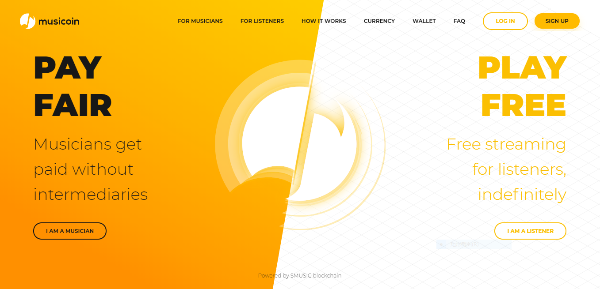

# 创新的音乐发布平台：Musicoin

[Musicoin.org](https://musicoin.org/) 不仅是一个国际化的音乐发布与收听平台，还是一个自由的音乐市场。来至世界各地风格不同的音乐人在这里发布了大量优秀的作品，音乐爱好者可以自由挑选并聆听自己喜欢的音乐，对于特别喜欢的音乐人或音乐作品还可以进行数额不等的打赏支持，系统会自动记录每首作品的收听数量与打赏金额，并换算为一种专门为音乐价值交换而设计的数字货币—— Musicoin （中文名称：乐币），现在乐币已经得到国际主流数字货币交易市场的认可，音乐人可以通过交易市场把乐币兑换为自己需要的各种实体货币。

Musicoin 创新的实现了音乐流通与开放数字货币的结合，为音乐人构造与建设了最自由而公平合理的展示与获得回报的机会，从此，音乐人可以摆脱传统音乐出版及现在音乐代理发行网站的剥削，并免受盗版下载者无任何回报对音乐发展及养育的破坏，从而获得最大的自由发展空间以及更丰硕的回报。

欢迎更多的音乐人及音乐爱好者加入，共同拓展 Musicoin 全新的音乐空间。

更多内容请浏览下面 Musicoin 介绍。

> 1. [简介](musicoin-profile.md)
> 2. [注册 Musicoin](musicoin-reg.md)
> 3. [Musicoin 基本使用](musicoin-basic-use.md)
> 4. [查看作品的收入](musicoin-jiemian.md)
> 5. [发布音乐作品](musicoin-posted.md)

> 1. [Musicoin 问答](musicoin-faq.md)
> 2. [Musicoin 中文歌手状况](musicoin-china-songster.md)
> 3. [Musicoin 时间线](musicoin-historymd.md)

> 1. [Musicoin 桌面版钱包](musicoin-desktop-wallet.md)
> 2. [Musicoin 兑换为人民币](musicoin-exchange.md)

> 1. [查询区块链数据](https://orbiter.musicoin.org)
> 2. [挖矿相关](musicoin-mining.md)

> 1. [开发](musicoin-api.md)
> 2. [技术名词解释](musicoin-technique.md)

> 1. [联系 Musicoin](musicoin-contact.md)
