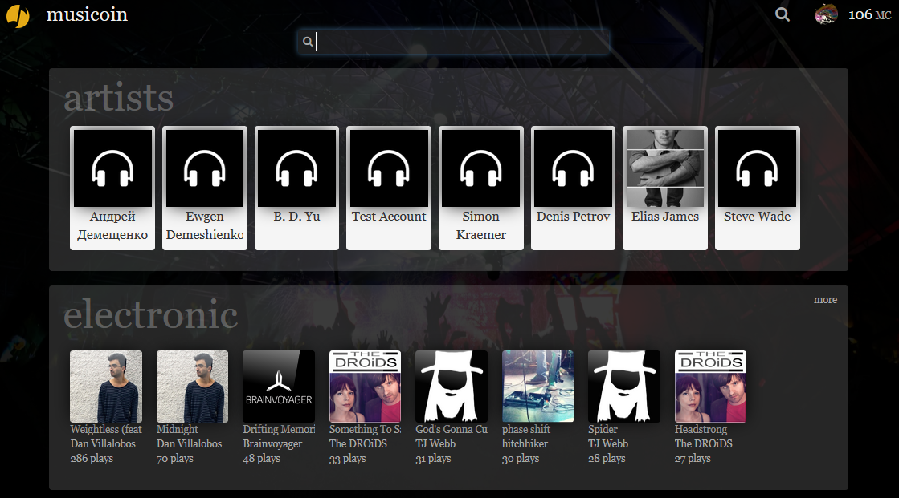

# musicoin 基本使用

Musicoin  ( [https://musicoin.org](https://musicoin.org) ) 是支持音乐、信息、货币流动起来的空间。

### 不登录收听

虽然在目前不登录系统也可以收听音乐，但后台的机制是由系统帮你支付收听费用，这种方式下，你只需要在浏览器的地址栏输入一首音乐的链接，就会出现这首音乐的播放界面，如下图所示。

这首音乐的链接： [https://alpha.musicoin.org/nav/track/0x91c4b71bd729f0162e5144f64fe76a7e3f190d5d](https://alpha.musicoin.org/nav/track/0x91c4b71bd729f0162e5144f64fe76a7e3f190d5d)

在这个界面中，点击 Play 就会开始播放音乐。

## 1. Musicoin 的特色

很容易就可以与 Musicoin 做亲密接触，点开这个 [链接](https://musicoin.org/nav/track/0xcf60eca8427105342723556f3cbd42c639b18c72)， 会打开歌手 brian byrne 演唱 tailor made 的页面，如下图：

点击头像下方的 **Play** 播放按钮就会在页面底部显示播放栏，并开始播放音乐。

在这个界面中展现出了一些 Musicoin 的特色：

### 1. 音乐家页面链接

点击头像上方的蓝色“brian byrne”可以转到 brian byrne 的主页面，能够查看以下内容。

1. brian byrne 发布的其它作品；
2. brian byrne 打赏他人的记录；
3. brian byrne 发布的消息。

### 2. 播放、小费与收入统计

1. Play 按钮下面的 13MC ，表示 brian byrne 从这首歌曲得到的总收入为 13个 Musicoin（Musicoin 平台的数字货币）；
2. 在下面一行显示 “11 plays + 2 tips ”，表示这首歌曲播放了 11 次，得到 11 个 Musicoin 的收入，2 表示这首歌曲得到 2 个小费；
3. 再往下面的 “Send a Tip”是用户给这首歌曲打赏小费的按钮，可以选择 1MC  或 5MC 或 10MC 。

### 3. 打赏与评论

在播放页面的右侧会显示打赏与评论。

1. 当用户对一个歌曲打赏后，用户的头像及打赏的金额会显示在右侧；
2. 用户也可以在右侧对当前歌曲发布评论，评论可以被其它用户回复；
3. 对于其它用户的评论或打赏，也可以进行加星操作，加星后也会发送一个币给评论或打赏用户。

### 4. 搜索

登录后，你还可以通过搜索方式查找音乐，方法是点击右上角的搜索图标，或者是直接输入搜索链接：[https://musicoin.org/nav/browse](https://musicoin.org/nav/browse)

在搜索页面，可以根据音乐家或音乐种类查找或搜索音乐，如下图所示。

### 5. 举报滥用行为

在右侧页面底部有一个“Report abuse”，点击这个链接可以通过电子邮件举报滥用行为。

