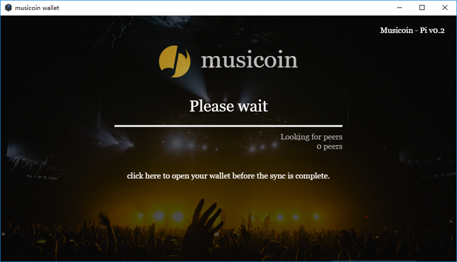
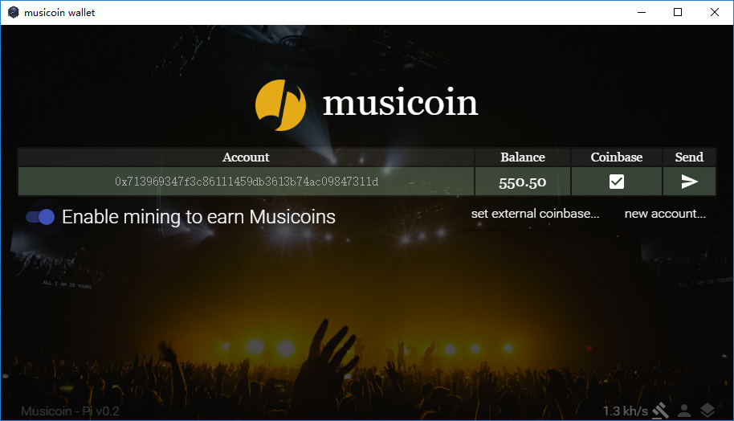
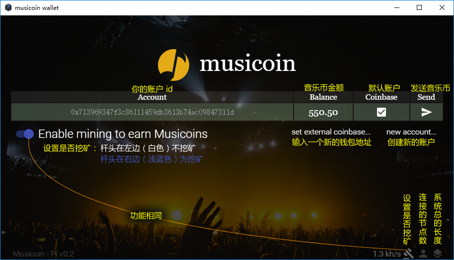

# Musicoin Desktop Wallet 桌面版钱包

此文是 Musicoin Desktop Wallet 的说明文档。

Musicoin Desktop Wallet 是 musicoin 官方桌面版钱包，可以在本地备份私钥，也可以用于 musicoin 挖矿，V0.7 开始支持 UBI。

> 在其它一些数字货币交易网站也可以建立 musicoin wallet ，但 Musicoin Desktop Wallet 提供更丰富的功能。

### 1. Musicoin Desktop Wallet 的下载与启动

下载地址：https://github.com/Musicoin/desktop/releases

下载回来，解压缩后，不需要安装，点击 Musicoin-client.exe 就可以启动。

### 2. Musicoin Desktop Wallet 的使用

目前只显示两个界面，一个是启动界面，一个是钱包的界面。启动界面如下图所示。

在启动界面几乎不需要做什么操作，如果软件与其它节点建立稳定连接，就会自动转到音乐币操作界面，如下图所示。

钱包界面各项功能如下图所示。

其中系统总长度数字是区块链的区块总数，区块总数乘 314 就是总的货币发行量。但在以太坊（Ethereum）中，有一种特殊的 [叔块](https://jysperm.me/2016/05/blockchain-slides/)（Uncle Block）区块会独立出现，也会产生一些货币，但这类区块不是很多。

### 3. Musicoin Desktop Wallet 私钥的备份
C:\Users\用户名\AppData\Roaming\Musicoin\keystore

- 如何备份钱包的官方指导：https://github.com/Musicoin/desktop/wiki/Backup-your-Wallet