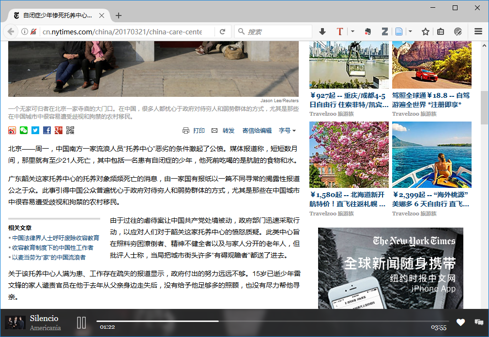

# “让音乐陪伴浏览”的畅想

如果在线浏览一篇文章的时候，会有一首与文章风格相似的音乐响起，会不会是很有趣的事情呢？

这是一个关于音乐的创想。

音乐已经陪伴人类很多年，但大多数时候需要人们主动去开启，而设想中的情景音乐可以自发的出现（当然会有一个开关允许你关闭这个功能）。

实现后，大体是下面这样一个外观（注意看下面的音乐播放栏）：

如果在广泛的网站实现这样的场景，离不开站长们的配合。

## 对于站长

对于站长来说，只需要在页面中嵌入一段代码就可以，甚至可以设想用于取代  Adwords ，因为这样做可以给站长带来收入。

**1. 怎么实现？**

至少可以有两种方式，一种是可以根据总的播放量给站长分成，一种是用户每收听一次，站长就得到一次的收入。

**2. 那就是需要有人付费？**

对，阅读用户付费。

**3. 这样做的话，会不会是一个复杂的过程？**

有一个音乐网站有合适的基础去做这种运营的支持，

[Musicoin.org](https://musicoin.org) （[更多 Musicion 的介绍](https://github.com/ooof/Project-2017/tree/master/Musicoin)），由音乐家和技术专家发起，使用第三代区块链技术实现的数字货币（乐币），支持智能合约，系统开放透明。可以帮助站长快速安全实现音乐播放模块。

**4. 这样做的好处？**

对于访问用户，改善了用户的阅读体验，解决了阅读枯燥的问题，也增加了阅读情感的配合。

对与站长来说，可以增加用户在网站的停留时间。