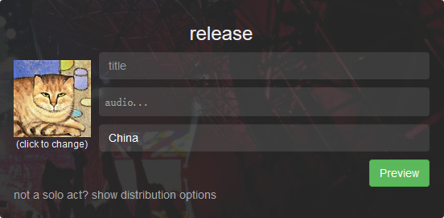
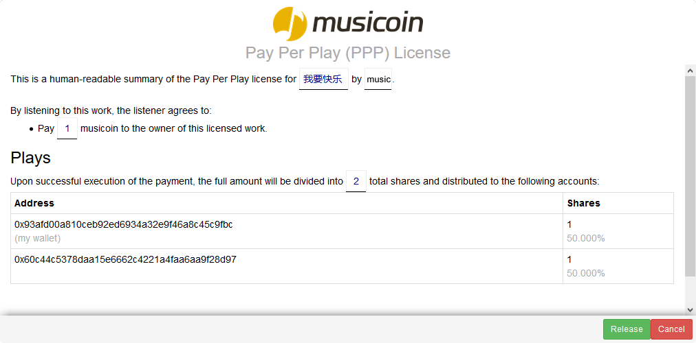
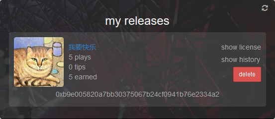

# Musicoin Faq

## 1. 创建 Musicoin 的出发点？

大众需要音乐，创作需要成本，大众在获得音乐享受的同时，最好用某种恰当的方式去回报音乐创作者。而传统的音乐发行模式不能很好的保证音乐家的收入，Musicoin 为解决这个难题而创建。

> 相似国内产品有汪峰创建的“碎乐”：[www.suiyueyule.com](www.suiyueyule.com) ，但差异也很多。

## 2. 如何实际体验？

- Musicion 官网：[https://musicoin.org/](https://musicoin.org/)
- 音乐播放示例：[https://musicoin.org/nav/track/0x91c4b71bd729f0162e5144f64fe76a7e3f190d5d](https://musicoin.org/nav/track/0x91c4b71bd729f0162e5144f64fe76a7e3f190d5d) ，此链接的界面如下图所示（点击播放按钮就可以播放，在移动设备也可以）：

## 3. 如何登录？

目前两种方式进入：

1. 好友邀请；
2. 在这里申请进入：[https://musicoin.org/invite?type=musician](https://musicoin.org/invite?type=musician)

但目前两种方式收到注册链接后，都需要通过国外社交网站，如 Google 、Twitter 、Facebook 的账户登录，这样需要用户有科学上网能力。如果暂时不具备需要等网站支持新浪微博登录以后再进入。

## 4. 如果 Musicoin 不是基于传统货币，听众如何获得这种数字货币？

Musicoin 系统中的所有货币都来自采矿。然而，我们知道大多数听众可能没有时间或兴趣去采矿，在早期，我们配置服务器挖矿，替用户支付收听费用，而音乐家则可以得到全额的收入。另外，听众也可以通过 [http://slack.musicoin.org](http://slack.musicoin.org) 的 #trading 频道交换货币。

## 5. 最初的货币（乐币）是怎么来的？

与比特币一样，最初（以及所有）的货币都由矿工挖矿所得。

听众可以自己挖矿，或在交易市场购买乐币，最初，系统会帮用户支付一定的收听费用。

## 2. 怎么获得收入？

> 如果有不少消费方式，那么如何获取收入呢？

当然，在 Musicoin社区，最好的情况是，你唱歌水平较好，或者善于演奏某种乐器，那么你就可以把你的作品发布在 Musicoin ，这样你就可以像其它音乐家一样，通过你的音乐作品去赚取播出收入与小费，并且你是与全球音乐家同台竞艺，如果有作品有足够生命力那么就可以持续的有收入。

## 6. 如果 Musicoin 不是基于传统货币，听众如何获得这种数字货币？

Musicoin 系统中的所有货币都来自采矿。然而，我们知道大多数听众可能没有时间或兴趣去采矿，在早期，我们配置服务器挖矿，替用户支付收听费用，而音乐家则可以得到全额的收入。另外，听众也可以通过 [http://slack.musicoin.org](http://slack.musicoin.org) 的 #trading 频道交换货币。

## 7. 听众为什么愿意为音乐付费？

我们相信，大多数听众会乐意给他们喜欢的音乐家支付费用，盗版由两个因素驱动：

> 1. 方便
> 2. 听众和艺术家之间缺乏连接

通过建立一个简单，低成本的系统，提供听众和艺术家之间的直接联系，我们认为没有人有非法获得音乐的动机。

## 8. 谁设置每首音乐的价格 - 音乐家或听众？

我们的目标是让音乐家自己控制一切。他们可以使用标准价格（也就是每收听一次一个货币），或者他们也可以根据个人意愿设置更高或更低的价格。此外，音乐家可以自定义如何分配每笔付款。

一首音乐，用户每收听一次，就向音乐家支付一次费用，具体费用由音乐家制定（目前默认是一个乐币）。

收听所得费用 100% 归音乐家支配。系统不会分成，也不会赚取任何其它费用。

## 9. Musicoin（乐币）除了收听音乐还有什么价值？

Musicoin 会与其它数字货币对接，有些国际交易所已经在准备上线，中国地区还没有交易所开始交易。

> 国内类似的数字货币交易所：[https://bter.com/](https://bter.com/)

## 10. 音乐家如何上传作品？

以录音文件方式，比如 MP3 格式的文件上传就可以。

## 11. 发布音乐需要注意什么？

如果一首作品的音乐家只有一个人，那么填写以下内容就可以发布：

> 1. 音乐名称
>
> - 上传音乐文件
> - 填写一些关键词
> - 可以给音乐更换一个贴切的封面

如下图所示。

如果一首作品的音乐家有多个人，那么可以点击下面的 “not a solo act? show distribution options”点开分成选项。

在分成选项中，默认只有一个分成人（也就是您），点击 “+ add another entry ”会增加一行填写框，在这里可以添加更多的合作者，如下图所示。

> 1. 在前面的框，填写合作者的钱包地址。为方便记忆也可以输入合作者注册 Musicoin 的邮件地址。如果有词曲授权方，还可以输入词曲授权方的地址。
> 2. 在后面的框，填写分成方式。分成用整数表示，如果有三个乐队成员，其他们等到相同的金额，那么可以可以设置为，每个人为 1 。如果分成总数为 100 的话，就与百分百的的情况相同。

填写完成后，点击“Preview”就可以查看授权协议，如下图所示。

然后点击下面绿色的 “Release” 按钮就可以发布。

## 12. 用户付费后，音乐家多长时间可以收到货币？

几乎立刻。

当发布的音乐有用户收听后，在音乐家 [https://alpha.musicoin.org/nav/profile](https://alpha.musicoin.org/nav/profile) 页面的 My Releases 位置可以查看播放数量，点击 “show history”可以查看收入情况，如下图所示。

## 13. 那么，我现在如何获得邀请？

我们想确保每个音乐家和听众都有一个良好的使用 Musicoin 的体验，所以我们慢慢增加用户数量。如果您是音乐家或只是对测试有兴趣，请在 [https://musicoin.org/invite?type=musician](https://musicoin.org/invite?type=musician) 申请，等待获得邀请。或者如果需要，请发送电子邮件至 musicoin@musicoin.org 联系。

或者，也可以询问你已经开始使用 Musicoin 的朋友，请他们邀请你进来。

## 14. 关于歌手与 Musicoin 的版权协议

有些歌手可能希望与 Musicoin 之间的有有一个版权合同。

但在 Musicoin 网站，歌手无须与 Musicoin 或任何第三方签署合同，而是实行歌手的自我控制。

歌手可以发布或移除自己的作品，可以与作品利益相关人分配收入（并且这种分配会自动得到执行，而无需人工干预）。

相对应的，为维护 Musicion 的健康以及保护他人权益，Musicoin 有权力移除被投诉的作品或不合理的内容。