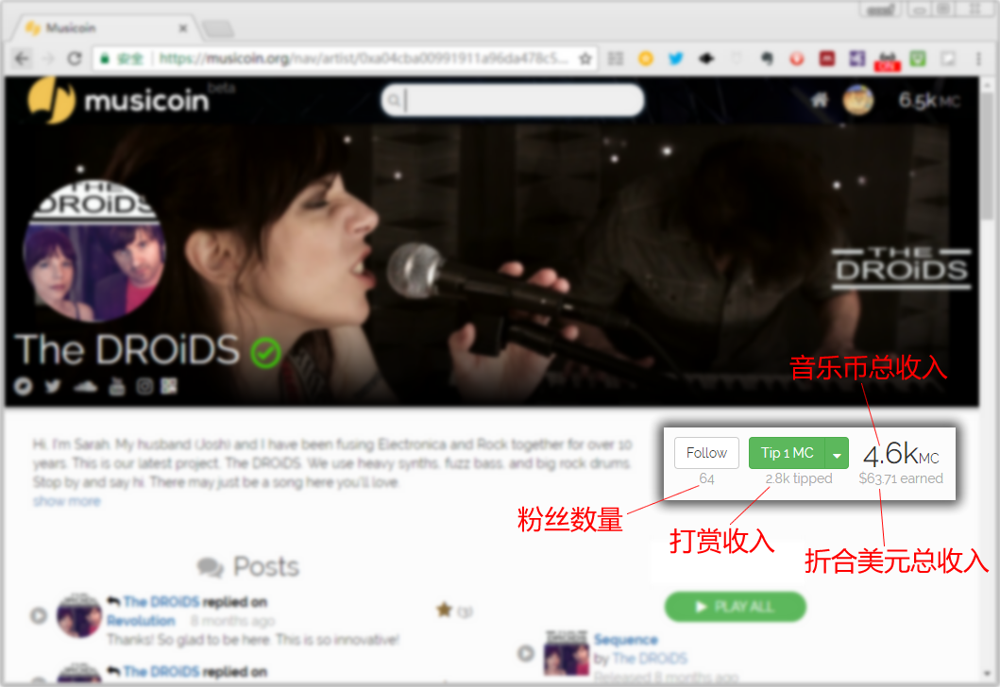
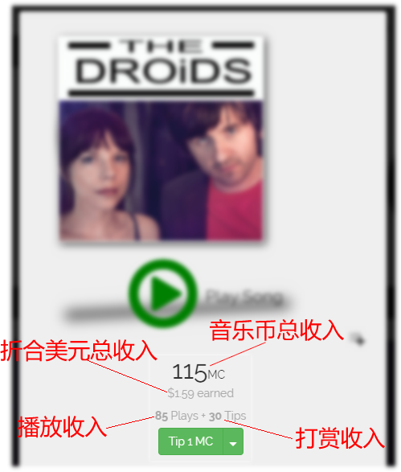

# 查看收入

即使不登录 Musicoin.org ，也可以查看任何一个音乐人或者音乐人作品的收入。

### 1. 查看音乐人总体的收入

比如音乐人  The DROiDS 的页面：https://musicoin.org/nav/artist/0xa04cba00991911a96da478c5b13f78c561990bcb

在大横幅图片下面的右侧，就可以看到这个音乐人收入的总体情况，如下图所示。

### 2. 查看一首音乐作品的收入

比如查看音乐人 The DROiDS 作品 Something To Say 的页面 ： https://musicoin.org/nav/track/0x0a69e7ae0e6b2f47cdc921cce5e24a768f7f6711

在左侧的音乐封面下面会显示这首作品收入的状况，如下图所示。

### 3. 通过区块链浏览器查看音乐人的收入

Musicoin 区块链浏览器： https://explorer.musicoin.org/ 
在区块链浏览器右上角的输入框输入音乐人的地址，就可以查看音乐人所有的收入。
