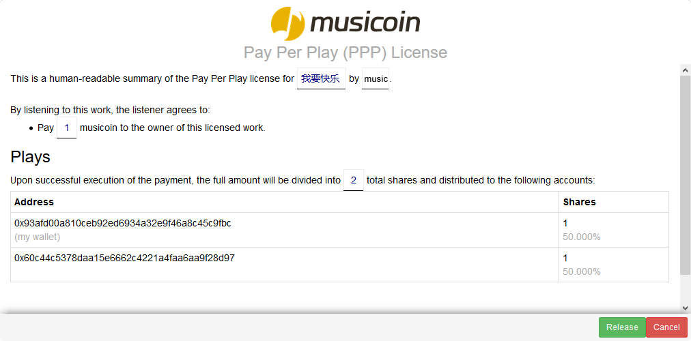

# 如何发布音乐作品的步骤

发布音乐需要在登录后进入后台页面，链接：[https://musicoin.org/nav/profile](https://musicoin.org/nav/profile)。

在后台找到 Release 的位置，这里用来发布音乐，如果一首作品的音乐家只有一个人，那么填写以下内容就可以发布：

> 1. 音乐名称
>
> - 上传音乐文件
> - 填写一些关键词
> - 可以给音乐更换一个贴切的封面

如下图所示。

音乐作品以文件的方式上传，比如一个 MP3 格式的文件（系统支持各种格式的音乐文件）。

如果一首作品的音乐家有多个人，那么可以点击下面的 “not a solo act? show distribution options”点开分成选项。

在分成选项中，默认只有一个分成人（也就是您），点击 “+ add another entry ”会增加一行填写框，在这里可以添加更多的合作者，如下图所示。

> 1. 在前面的框，填写合作者的钱包地址。为方便记忆也可以输入合作者注册 Musicoin 的邮件地址。如果有词曲授权方，还可以输入词曲授权方的地址。
> 2. 在后面的框，填写分成方式。分成用整数表示，如果有三个乐队成员，其他们等到相同的金额，那么可以可以设置为，每个人为 1 。如果分成总数为 100 的话，就与百分百的的情况相同。

填写完成后，点击“Preview”就可以查看授权协议，如下图所示。

然后点击下面绿色的 “Release” 按钮就可以发布。
