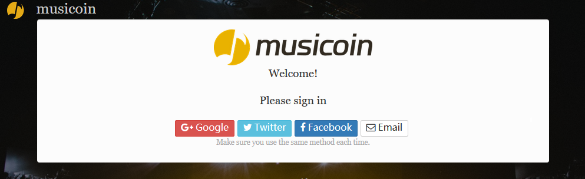

## 1. 注册

目前有两种方式获得注册资格：

1. 在网站申请，申请地址：[https://musicoin.org/invite?type=musician](https://musicoin.org/invite?type=musician) ，获得通过后，得到邀请链接申请进入。
2. 获得已经进入系统好友的邀请，并通过邀请链接申请进入。

通过以上两种方式中的任何一种，都可以得到注册资格。具有注册资格后，就可以通过 Google 、Twitter 、Facebook 三种社交网络的任何一个账户登录（要记住第一次的选择，并保证以后每次都用这个账户登录）。

如果不使用社交媒体账户登录，还可以通过电子邮件方式注册，并在以后通过邮件地址与密码的方式登录。