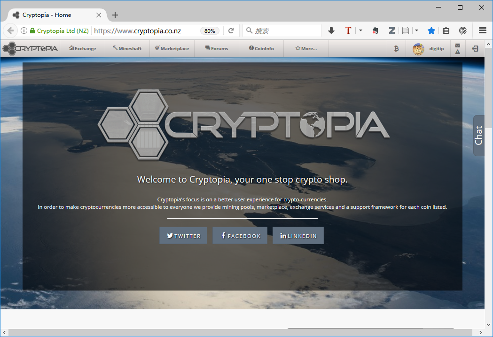
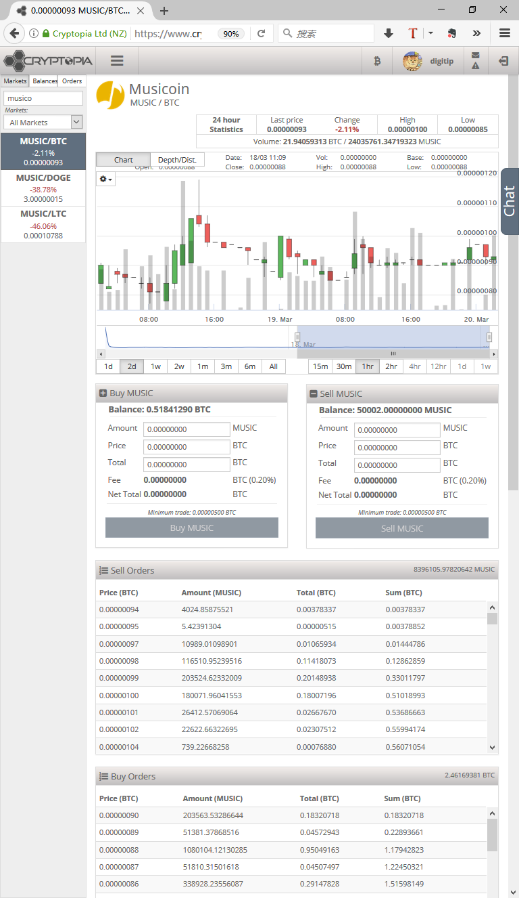
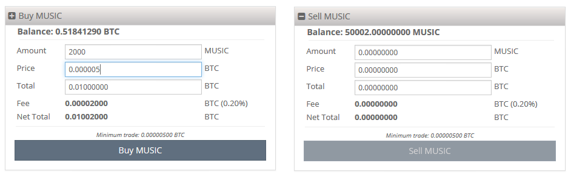
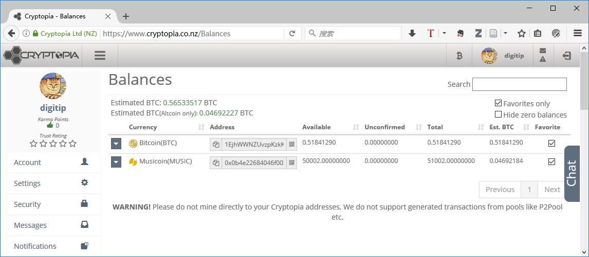
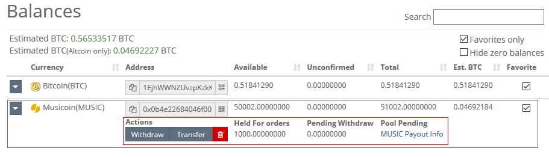

# 在 Cryptopia 市场交易 Musicoin 的方法

> 现在可以在 Cryptopia 市场交易 Musicoin （乐币）了。 

Cryptopia 是一个数字货币（几百种）综合应用市场，也包括对数字货币交易的支持。本文对 Cryptopia ，以及如何在  Cryptopia 市场交易 Musicoin 做一个基本介绍。

## 1. 关于 Cryptopia

网站：[https://www.cryptopia.co.nz](https://www.cryptopia.co.nz)

 **Cryptopia 的功能**：

- 可以查看各种数字货币的基本信息，查看历史交易情况
- 可以查看矿池和矿工的信息
- 可以在不同数字货币之间进行交换
- 数字钱包的操作，包括存入和提现
- 用数字货币购买彩票
- 用户交流论坛

## 2.  如何在 Cryptopia 市场交易 Musicoin ？

Musicoin 已经入驻 Cryptopia ，可以通过以下链接访问。

- 货币信息：[https://www.cryptopia.co.nz/CoinInfo/?coin=MUSIC](https://www.cryptopia.co.nz/CoinInfo/?coin=MUSIC)
- 交易链接：[https://www.cryptopia.co.nz/Exchange/?market=MUSIC_BTC](https://www.cryptopia.co.nz/Exchange/?market=MUSIC_BTC)

在 Musicoin 的交易页面，可以查看 Musicoin 与比特币汇率的走势，也可以直接进行 Musicoin 的买进或者卖出，如下图所示。

### 2.1 交易

在 Cryptopia 交易中，买卖双方自由报价，系统自动匹配成交（也就是有人卖出，才能有人买入）。

交易界面就在交易链接页面中部，左侧为买入，右侧为卖出，如下图所示。

人性化的一点是，即使你报了较高的价格去买入，但如果有人低价卖，那么系统会优先匹配最低的价格（可以保证你不花冤枉钱）。

### 2.2 提款与转账

点击右上角用户头像左边的 B 图标，会进入钱包页面，链接为 ： [https://www.cryptopia.co.nz/Balances](https://www.cryptopia.co.nz/Balances) ，界面如下图所示。

在这里可以进行货币的提款和转账，提款是把系统内的货币转出到外部账户，转账是系统内部，把数字货币转给其它用户。进行提款和转账操作需要点击货币左边的下箭头，如下图所示。

点击之后，会在所选货币下面出现 Withdraw（提款）与 Transfer（转账）按钮，在此操作就可以。
